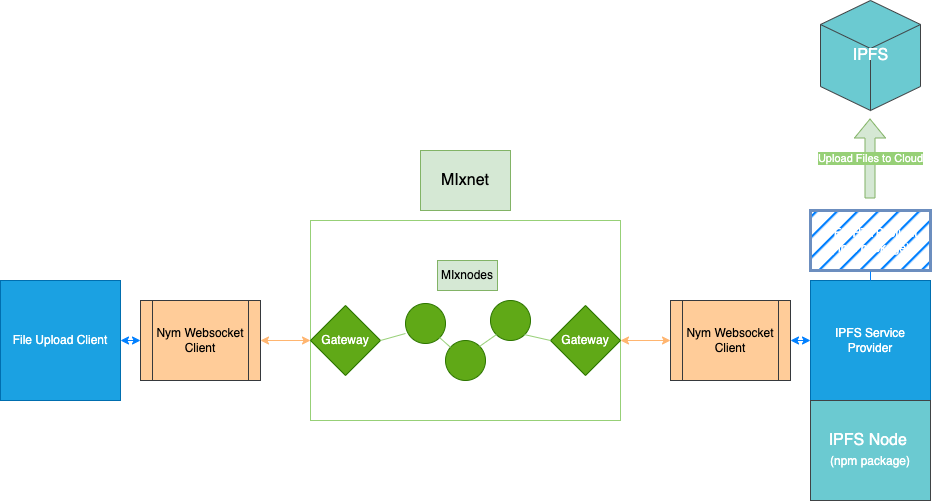
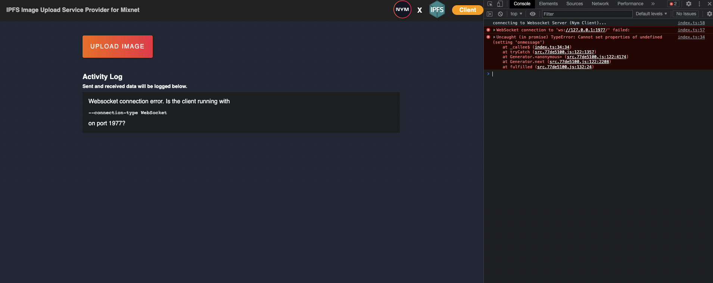
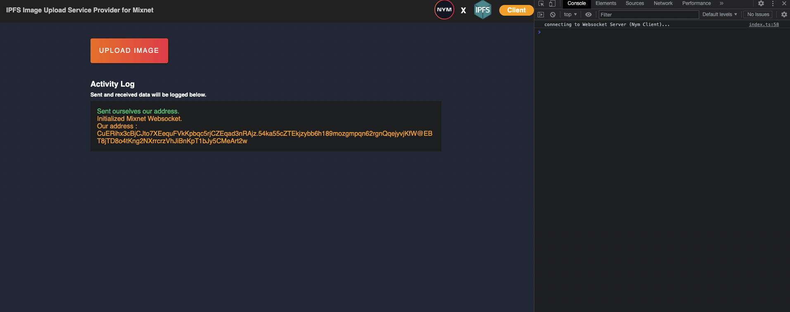
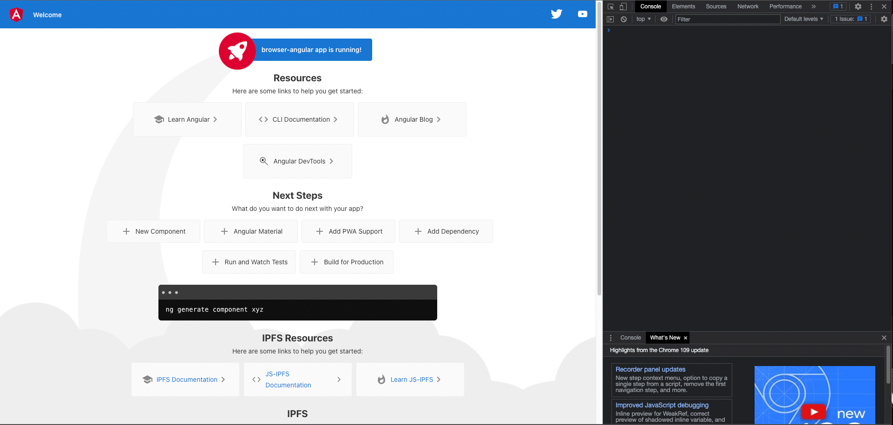
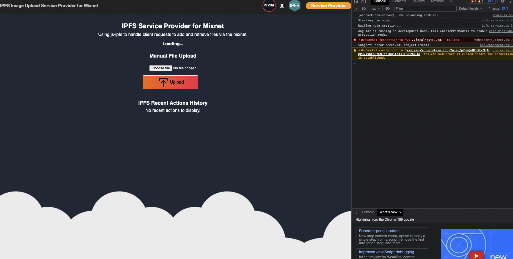
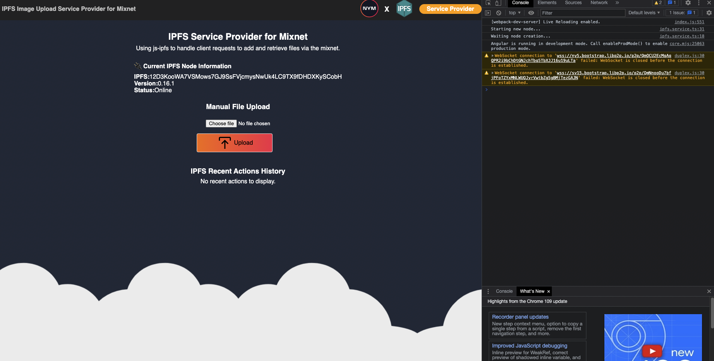
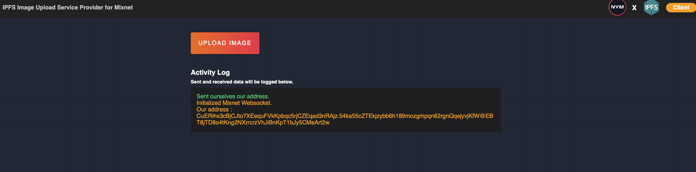
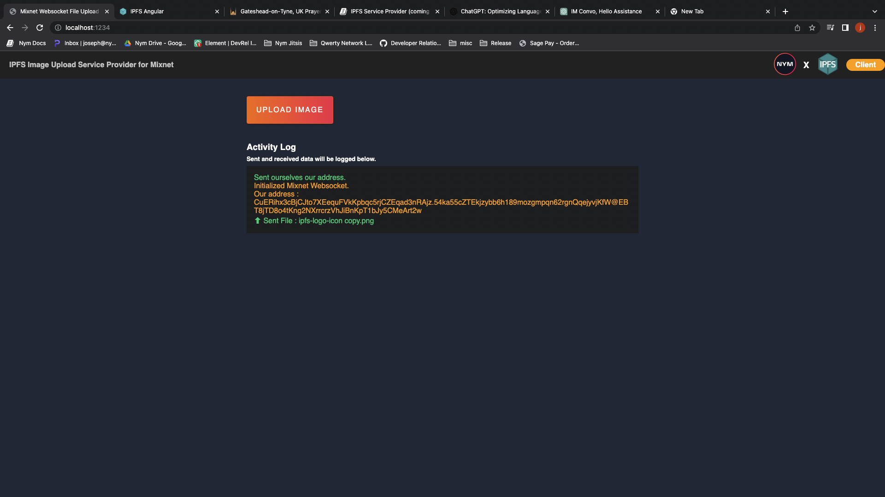
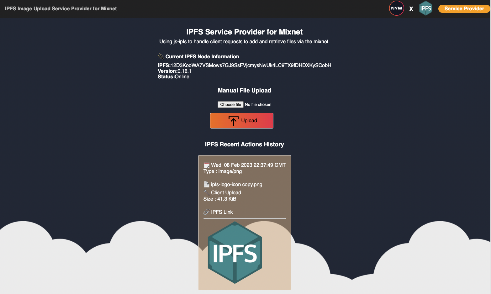

# Building a Image Upload Service Provider with IPFS.

In this guide, developers will be able to observe how using Nym Websocket Client can be utilized to create a Service Provider that will be able to receive data from a Client, perform a requested operation and then return the results of that operation back to the client.


#### What are we building?

In this tutorial, you will learn how to build a User Client that allows a user to upload an image to the browser and send it through the mixnet, via our Nym Websocket Client. You'll also then learn how to create a typescript Service Provider, which will recieve the image that our client sent.The Service Provider will then upload that image to IPFS and return the results of that back to the User Client.

We will be buildiing:
- A User Client written in TypeScript, which allows for uploading images to then be passed to a Nym Websocket Client to be sent through the mixnet.
- A Angular Typescript Service Provider, which can receive images from the User Client and then uploads it to IPFS via a built-in js-ipfs node. The service provider will then return the uploaded file url back to the User Client.
- We will also be refreshing our knowledge on using the Nym Websocket Clients that we used in the previous tutorial.

> ⚠️ Service providers are usually run on remote servers to keep metadata private, but for demonstration purposes, this tutorial will show how to run it on a local machine using looped messages through the mixnet.



We'll dive into the process of creating a Typescript application in a similar process to how we have done previously. We will then also utilize a pre-built Angular Typescript codebase that includes a packaged IPFS node provided by the [IPFS Examples repository](https://github.com/ipfs-examples) repo. Each application will have its own Nym Websocket Client to append their images/messages to, which we will also configure.

You don't need to have any expertise in Angular or Typescript in order navigate this tutorial as we will go through setting up our applications step by step. Feel free to re-use any functionality you discover that might useful.

To assist in your learning, the complete code for this tutorial is available on [Github](https://github.com/nymtech/developer-tutorials). You can use it as a reference while building or simply download it and follow along as you progress through the tutorial."

#### What do we want to achieve?

We are looking to create a a method of sending image data anonymously to a Service Provider, which will then upload our image to the [IPFS (InterPlanetary File System) ](https://ipfs.tech/). We then want the url of the image we uploaded to IPFS to be returned to our User Client. We also want a manual way of Uploading files to IPFS straight from the Service Provider itself, so we can separate between IPFS and MIxnet logic clearly if we wanted to debug our application to see whether IPFS failed or the Nym Websocket Clients failed.

#### What is IPFS?

IPFS is a globally distributed file storage system that operates on a peer-to-peer network. Any computer can participate by downloading the IPFS software and acting as a host for storing and serving files. Once a file is uploaded to the IPFS network by a user, it can be accessed and retrieved by any other IPFS user worldwide.

IPFS allows for developers to utilize their API features to integrate into applications they are developing. You can find out more in their documentation [here](https://js.ipfs.tech/).

#### Why use IPFS?
- Decentralized and distributed: IPFS is a peer-to-peer network, so it can provide more reliability and stability compared to traditional client-server networks, where data is stored on a single server.
- Improved performance: IPFS can speed up file transfers and reduce the load on a single server by breaking files into smaller pieces and distributing them across multiple nodes.
- Tamper-proof: IPFS uses cryptographic hash functions to ensure that the contents of files stored on the network cannot be altered without being detected.

### Prerequisites.
* `node v18.12.1`. We suggest that you use [nvm](https://github.com/nvm-sh/nvm) to switched the specified version to ensure correct compilation of all components.
* `npm` 
* A copy of the Nym Websocket Client (nym-client) on your local machine. If you need to acquire one, visit [here on how to build the Nym Monorepo](https://nymtech.net/docs/binaries/building-nym.html)

### Building the User Client.
#### Setting up our Application
Make a new directory called `ipfs-upload-service-tutorial` and inside it create another folder named `user-client`.

>   
    Our directory so far:

    ipfs-upload-service-tutorial/
    ├─ user-client/

Continue to then do the following:

1.  `path/to/the/user-client` folder you created, and run:

    ```
    npm init
    ```
Continue just press enter after each prompt to confirm the configuration.

<details>
    <summary>Console Output</summary>
       
        This utility will walk you through creating a `package.json` file.
        It only covers the most common items, and tries to guess sensible defaults.

        See `npm help init` for definitive documentation on these fields
        and exactly what they do.

        Use `npm install <pkg>` afterwards to install a package and
        save it as a dependency in the package.json file.

        Press ^C at any time to quit.
        package name: (user-client)
        version: (1.0.0)
        description:
        entry point: (index.js)
        test command:
        git repository: 
        keywords:
        author: 
        license: (ISC) 
        About to write to path/to/directory/user-client/package.json:

        {
            "name": "user-client",
            "version": "1.0.0",
            "description": "",
            "main": "index.js",
            "scripts": {
                "test": "echo \"Error: no test specified\" && exit 1"
            },
            "author": "",
            "license": "ISC"
        }

        Is this OK? (yes) 
</details>

A `package.json` file has been created in the folder.

2. Then in the same terminal, run:

```
npm install typescript
```
After the installation has been completed, check to see that the typescript dependencies have been added. The `package.json` file should look like this:

    {
        "name": "user-client",
        "version": "1.0.0",
        "description": "",
        "main": "index.js",
        "scripts": {
            "test": "echo \"Error: no test specified\" && exit 1"
        },
        "author": "",
        "license": "ISC",
        "dependencies": {
            "typescript": "^4.9.3"
        }
    }
    

3. Now run in your terminal:
    
```
npm install ts-node --save-dev
```
The package (`ts-node`) allows us to build a typescript application in a node environment.

4. Create a new file in the `user-client` folder called `tsconfig.json`. Paste the following code into the file:

```
{
    "compilerOptions": {
        "module": "commonjs",
        "esModuleInterop": true,
        "target": "es6",
        "moduleResolution": "node",
        "sourceMap": true,
        "outDir": "dist"
    },
    "lib": ["es2015"]
}
```

>   
    Our directory so far:

    ipfs-upload-service-tutorial/
    ├─ user-client/
    │  ├─ package.json
    │  ├─ tsconfig.json

#### Bundling the Application

 To build and run our application locally, we require a tool that allows us to work on it while it's running and instantly reflects saved changes on the browser.

1. This can be achieved through the installation of Parcel bundler using the following command in your terminal window:

```
npm install --global parcel-bundler
```

After completing the installation process, start by creating a `src` folder within the `user-client` folder. Within this `src` folder, create two new files:
* `index.html` 
* `index.ts`


 2. Paste the following the `index.html`:
    
    ```
    <!DOCTYPE html>
    <html>
        <head>
            <title>App Test</title>
            <meta charset="utf-8"/>
        </head>
        <body>
            <h1>Test</h1>
            <div id="app"></div>
            <script src="index.ts"></script>
        </body>
    </html>

    ```

    And in the `index.ts`:

    ```
    console.log('test log')
    ```

This will ensure that our TypeScript file is functional when the application is launched in the browser.
    
3. Navigate to the `package.json` file and in the `"scripts"` array, add the following above `"test"`:

```
"start": "parcel src/index.html"
```

Now back in our terminal , run `npm start`.


Open your browser at [localhost:1234](http://localhost:1234/). 

Your web application is now up and running with `Test` displayed on the browser window.

Checking the `console.log` output is done by right-clicking on the browser and selecting __Inspect__, then navigating to the __Console__ section of the resulting panel. You should see the message `test log` displayed there.

>   
    Our directory so far:

    ipfs-upload-service-tutorial/
    ├─ user-client/
    │  ├─ package.json
    │  ├─ tsconfig.json
    │  ├─ src/
    │  │  ├─ index.ts
    │  │  ├─ index.html

#### Writing the application logic.

In our `index.ts`, we will remove our `console.log` statement and then copy and paste the code found below. This code is what we need to initialize our Websocket, same to the code we have in our last tutorial, but with a couple of additional elements.

```
/*
    The address that is given to us from our mixnet client.
*/
var ourAddress : string;

/*
    Address we want to send our messages to.
*/
var targetAddress: string = '';

/*
    Variable that holds our websocket connection data.
*/
var websocketConnection: any;

/*
    Variable that holds our selectedPayload data.
*/
var selectedPayload: any;

const fileInput = document.querySelector('#fileInput')

async function main() {
    var port = '1977' // client websocket listens on 1977 by default.
    var localClientUrl = "ws://127.0.0.1:" + port;
    
    // Set up and handle websocket connection to our desktop client.
    websocketConnection = await connectWebsocket(localClientUrl).then(function (c) {
        return c;
    }).catch(function (err) {
        displayClientMessage("Websocket connection error. Is the client running with <pre>--connection-type WebSocket</pre> on port " + port + "?");
    })

    websocketConnection.onmessage = function (e) {
        handleResponse(e);
    };
    
    sendSelfAddressRequest();
    
    fileInput.addEventListener('change', onFileChange, false);
}

/*
    Get out address to log in the activity log so we know what our address is in the mixnet via our application UI
*/
function sendSelfAddressRequest() {
    var selfAddress = {
        type: "selfAddress"
    }
    displayJsonSend(selfAddress);
    websocketConnection.send(JSON.stringify(selfAddress));
}

/* 
    Connect to a websocket. 
*/
function connectWebsocket(url) {
    return new Promise(function (resolve, reject) {
        var server = new WebSocket(url);
        console.log('connecting to Websocket Server (Nym Client)...')
        server.onopen = function () {
            resolve(server);
        };
        server.onerror = function (err) {
            reject(err);
        };
    });
}
```

* `main()` - This initial function will contain most of the reasoning and start the interaction with the Nym Websocket Client. It is recommended to declare it at the beginning of the file and activate it upon launching the application by calling it at the end of our file.

* `connectWebsocket(url)` - This function returns a Promise that attempts to establish a websocket connection to the specified url. If the connection is established successfully, a notification will be received in the application and websocket client. On the other hand, if the connection fails, an error will be displayed in the app.

* `sendSelfAddressRequest()` - Function that retrieves the websocket address and displays it on the browser's UI after connecting to the websocket.

We also have our `fileInput` variable that stores the value of an input element that we will implement in our `index.html` further in the tutorial. We then assign an EventListener to invoke a function (`onFileChange`) when our browser detects a file change when we select one from our devices file explorer. Were going to be implementing `onFileChange` next.

```
/*
    Function that fires of then the selected file on our input changes. Enables for files to be uploaded instantly.
*/
function onFileChange(){
    selectedPayload = document.getElementById('fileInput').files[0];
    var reader = new FileReader();
    reader.readAsDataURL(document.getElementById('fileInput').files[0]);
    reader.addEventListener('load', readAndSendFile);
}

function readAndSendFile(event) {
    let blobResult = event.target.result
    sendMessageToMixnet(blobResult);
}
```
* `onFileChange()`: This function is triggered when a file is selected by the user and sets the selected file as `selectedPayload`, reads it as a data URL using `FileReader` and triggers the `readAndSendFile` function once the file has been read.

* `readAndSendFile(event)`: This function is triggered by the `FileReader` load event and sends the contents of the file (stored in `event.target.result` as `blobResult`) using the `sendMessage` function.

Next, we'll implement our `sendMessageToMixnet` that we just called in the last function we wrote. Type or paste out the following beneath the previous code.

```
/*
    Function that gets the form data and sends that to the mixnet in a stringified JSON format.
*/
function sendMessageToMixnet(payload) {
    
    var messageContentToSend  = {
         lastModified: selectedPayload.lastModified,
         lastModifiedDate: selectedPayload.lastModifiedDate,
         name: selectedPayload.name,
         size: selectedPayload.size,
         type: selectedPayload.type,
         dataUrl: payload
    };  
    
    /*We have to send a string to the mixnet for it to be a valid message , so we use JSON.stringify to make our object into a string.*/
    const message = {
        type: "send",
        message: JSON.stringify(messageContentToSend),
        recipient: targetAddress,
        withReplySurb: false,
    }
    
    //Display our json data to ber sent
    displayJsonSend(message);
    
    //Send our message object via out via our websocket connection.
    websocketConnection.send(JSON.stringify(message));
}

/*
    Handle any messages that come back down the websocket.
*/
function handleResponse(resp) {
    try {
        let response = JSON.parse(resp.data);
        if (response.type == "error") {
            displayJsonReceived("Server responded with error: " + response.message);
        } else if (response.type == "selfAddress") {
            displayJsonReceived(response);
            ourAddress = response.address;
            console.log(ourAddress)
            displayClientMessage("Our address is:  " + ourAddress + ", we will now send messages to ourself.");
        } else if (response.type == "received") {
            handleReceivedMessage(response)
        }
    } catch (_) {
        displayJsonReceived(resp.data)
    }
}
```
To ensure consistency with the previous tutorial, we will convert our message into a string format before transmission. Before sending the image over the mixnet, we will send the Blob (base64) value of the image to our service provider. The length of the Blob value increases with the size of the image, but it is necessary to send it to IPFS so it can consume the data. We can then retrieve the resulting IPFS URL from tat operation which we (eventually) want back.

* `sendMessageToMixnet()` - The key function that enables our Service Provider to receive messages performs several tasks. Firstly, it retrieves the values from the form in `index.html` and assigns them to local variables. These variables are then combined into a single object to be sent to the mixnet. Secondly, the function `displayJsonSend()` is called to display the sent message on the user interface. Lastly, the message is sent to the websocket using the global variable `websocketConnection`.

* `handleResponse()` - the function responsible for sorting between the types of messages it receives from the mixnet, depending upon the value the response's `type` property holds. From their, it invokes the appropriate function that the data requires.

At this point, we have some more functions that we need to write as indicated by our new functions. Underneath our new code, type or paste the following:

```
/*
    Display messages that relates to initializing our client and client status (appearing in our activity log).
*/
function displayClientMessage(message) {
    document.getElementById("output").innerHTML += "<p>" + message + "</p >";
}

/*
    Handle any string message values that are received through messages sent back to us.
*/
function handleReceivedMessage(message) {
    const stringifiedMessage = message.message
    displayJsonReceived(stringifiedMessage)
}

/*
    Functions that will display 'send' related event logs into our activity log.
*/
function displayJsonSend(message) {
    let sendDiv = document.createElement("div")
    let messageLog = document.createElement("p")

    messageLog.setAttribute('style', 'color: #36d481');

    let lineContent;

    if (message.type == 'selfAddress'){
        lineContent = document.createTextNode("Sent ourselves our address.")
    } else {
        let decodedMessage = message.message.replace(/\//g,"");

        // After using 'string.replace()' as above, we can turn our data back into an object. This will make it match our attributes defined in the MessageData interface
        let parsedMessage = JSON.parse(decodedMessage);

        lineContent = document.createTextNode("⬆ Sent File : " + parsedMessage.name)
    }

    messageLog.appendChild(lineContent)
    sendDiv.appendChild(messageLog)
    document.getElementById("output").appendChild(sendDiv)
}

/*
    Functions that will display 'send' related event logs into our activity log.
*/
function displayJsonReceived(message) {
    const timeElapsed = Date.now();
    const today = new Date(timeElapsed);
    let parsedMessage = JSON.parse(message);
    
    let dataLog = {
        url : parsedMessage.url,
        name: parsedMessage.name,
        dataUrl : parsedMessage.dataUrl,
        time : today.toUTCString()
    }
    
    let receivedDiv = document.createElement("div");
    let messageLogLine1 = document.createElement("p");
    let messageLogLine2 = document.createElement("p");

    messageLogLine1.setAttribute('style', 'color: orange;word-break: break-word;');
    messageLogLine2.setAttribute('style', 'color: orange;word-break: break-word;');

    let line1Contents;
    let line2Contents;

    if (parsedMessage.type == 'selfAddress'){
        line1Contents = document.createTextNode("Initialized Mixnet Websocket.");
        line2Contents = document.createTextNode('Our address : ' + parsedMessage.address);
    } else {
        line1Contents = document.createTextNode("⬇ " + dataLog.time + " | " + dataLog.name);
        line2Contents = document.createTextNode('Link: ' + dataLog.url);
    }

    messageLogLine1.appendChild(line1Contents);
    messageLogLine2.appendChild(line2Contents);
    
    receivedDiv.appendChild(messageLogLine1);
    receivedDiv.appendChild(messageLogLine2);
    document.getElementById("output").appendChild(receivedDiv);
}
```

Our two last will enable us to manipulate HTML elements in the DOM in order to update our UI when actions are performed in our application.

* `displayJsonReceived()` - The function that is responsible for sorting the contents of a received message from the mixnet. depending on whether it was a selfAddress request or an actual message from our service provider (with the URL we are ultimately looking for);

* `displayJsonSend()` - Does the same thing as `displayJsonReceived()`, only that invokes when we send a message.

At the very end of our file, lets call our `main()` function

```
main();
```

Our `index.ts` logic is now ready for us to move onto implementing the UI. Lets open up our `index.html` and type or paste the following code:
```
<!doctype html>
<html>
    <head>
        <meta charset="UTF-8">
        <title>Mixnet Websocket File Upload Client for IPFS</title>
        <link rel="stylesheet" href="../assets/styles/styles.css">
    </head>
    <body style="background-color: #242c3d;font-family: sans-serif;">
        <div class="toolbar" role="banner">
            <span class="toolbar-title">IPFS Image Upload Service Provider for Mixnet</span>
            <div class="spacer"></div>
            <a
              href="https://nymtech.net/"
              title="Nym"
              target="_blank"
            >
              
            </a>
            <h3> X </h3>
            <a
              href="https://docs.ipfs.tech/"
              title="IPFS"
              target="_blank"
            >
              
            </a>
            <div class="toolbar-tag">
                <p>Client
                </p>
            </div>
        </div>
        <div class="content" role="main">
            
            <div class="section-container">
                <div class="file-upload">
                    <label for="fileInput" class="file-upload-label">UPLOAD image</label>
                    <input id="fileInput" class="file-upload-input" type="file" accept="image/jpeg, image/png"/>
                </div>
            </div>

            <div class="section-container">
                <h3>Activity Log</h3>
                <h5>Sent and received data will be logged below.</h5>
            
                <p style="background-color: #202124;color: #fff;padding: 1rem;">
                    <span id="output"></div>
                </p>
            </div>
        </div>
        <script src="index.ts"></script>
    </body>
</html>
```

You may notice that we reference our `index.ts` file within the script tag of the `<body>`. You may recognize this from our previous application that we made in the last tutorial and this application works in the same way. We set this reference in order for our application to be bundled by parcel correctly.

Lets create our `style.css` file to apply some styling to our user interface. We will create a new `/assets` folder in the root of the project (same folder level as `package.json`). Create a `/styles` inside the `/assets` folder and create a new file inside it named: `styles.css`.
We now have a file that the `<head>` link attribute can access to find the stylesheet it was looking for. In `styles.css`, paste or type the following code:

<details>
    <summary>styles.css (Click to expand)</summary>
       
        :host {
        font-family: -apple-system, BlinkMacSystemFont, "Segoe UI", Roboto, Helvetica,
            Arial, sans-serif, "Apple Color Emoji", "Segoe UI Emoji", "Segoe UI Symbol";
        font-size: 14px;
        color: #333;
        box-sizing: border-box;
        -webkit-font-smoothing: antialiased;
        -moz-osx-font-smoothing: grayscale;
        }

        h1,
        h2,
        h3,
        h4,
        h5,
        h6 {
        margin: 8px 0;
        color: white;
        }

        p {
        margin: 0;
        }

        .spacer {
        flex: 1;
        }

        .toolbar {
        position: absolute;
        top: 0;
        left: 0;
        right: 0;
        height: 60px;
        display: flex;
        align-items: center;
        background-color: #252526;
        color: white;
        font-weight: 600;
        }

        .file-upload-label {
        box-shadow: 0 1.5px 4px rgba(0, 0, 0, 0.24), 0 1.5px 6px rgba(0, 0, 0, 0.12);
        background:linear-gradient(90deg, #f4731b 1.05%, #f12d50 100%);
        border: 1px solid #F4511E;
        border-radius: 4px;
        cursor: pointer;
        color: #fff;
        display: inline-block;
        float: left;
        letter-spacing:2px;
        text-transform: uppercase;
        padding:20px;
        margin: auto;
        }

        .file-upload-input {
        position: absolute;
        left: 0;
        top: 0;
        right: 0;
        bottom: 0;
        font-size: 1px;
        width: 0;
        height: 100%;
        opacity: 0;
        }

        .toolbar-tag p{
        color: white; 
        font-size: 16px; 
        background-color: Orange; 
        border:4px solid Orange; 
        border-radius: 18px;
        padding-left:1rem;
        padding-right:1rem
        }

        .toolbar img {
        margin: 0 16px;
        }

        .toolbar #twitter-logo {
        height: 40px;
        margin: 0 8px;
        }

        .toolbar #youtube-logo {
        height: 40px;
        margin: 0 16px;
        }

        .toolbar #twitter-logo:hover,
        .toolbar #youtube-logo:hover {
        opacity: 0.8;
        }

        .content {
        display: flex;
        margin: 82px auto 32px;
        padding: 0 16px;
        max-width: 960px;
        flex-direction: column;
        align-items: center;
        }

        .section-container {
        display: block;
        flex-wrap: wrap;
        justify-content: center;
        margin-top: 16px;
        margin-top: 1rem;
        margin-bottom: 1rem;
        width: 850px;
        }

        .manual-file-input{
        margin-bottom: 1rem;
        text-align-last: center;
        }

        .data-item-card{
        border-radius: 4px;
        border: 1px solid #eee;
        padding: 1rem;
        margin-bottom: 1rem;
        }

        a,
        a:visited,
        a:hover {
        color: #1976d2;
        text-decoration: none;
        }

        a:hover {
        color: #125699;
        }

        .terminal {
        position: relative;
        width: 80%;
        max-width: 600px;
        border-radius: 6px;
        padding-top: 45px;
        margin-top: 8px;
        overflow: hidden;
        background-color: rgb(15, 15, 16);
        }

        .terminal::before {
        content: "\2022 \2022 \2022";
        position: absolute;
        top: 0;
        left: 0;
        height: 4px;
        background: rgb(58, 58, 58);
        color: #c2c3c4;
        width: 100%;
        font-size: 2rem;
        line-height: 0;
        padding: 14px 0;
        text-indent: 4px;
        }

        .terminal pre {
        font-family: SFMono-Regular, Consolas, Liberation Mono, Menlo, monospace;
        color: white;
        padding: 0 1rem 1rem;
        margin: 0;
        }

        .circle-link {
        height: 40px;
        width: 40px;
        border-radius: 40px;
        margin: 8px;
        background-color: white;
        border: 1px solid #eeeeee;
        display: flex;
        justify-content: center;
        align-items: center;
        cursor: pointer;
        box-shadow: 0 1px 3px rgba(0, 0, 0, 0.12), 0 1px 2px rgba(0, 0, 0, 0.24);
        transition: 1s ease-out;
        }

        .circle-link:hover {
        transform: translateY(-0.25rem);
        box-shadow: 0px 3px 15px rgba(0, 0, 0, 0.2);
        }

        footer {
        margin-top: 8px;
        display: flex;
        align-items: center;
        line-height: 20px;
        }

        footer a {
        display: flex;
        align-items: center;
        }

        .github-star-badge {
        color: #24292e;
        display: flex;
        align-items: center;
        font-size: 12px;
        padding: 3px 10px;
        border: 1px solid rgba(27, 31, 35, 0.2);
        border-radius: 3px;
        background-image: linear-gradient(-180deg, #fafbfc, #eff3f6 90%);
        margin-left: 4px;
        font-weight: 600;
        }

        .github-star-badge:hover {
        background-image: linear-gradient(-180deg, #f0f3f6, #e6ebf1 90%);
        border-color: rgba(27, 31, 35, 0.35);
        background-position: -0.5em;
        }

        .github-star-badge .material-icons {
        height: 16px;
        width: 16px;
        margin-right: 4px;
        }

        /*Added by me*/
        .toolbar-title{
        margin-left: 20px;
        color: #c8c8c8;
        }

        /* Responsive Styles */
        @media screen and (max-width: 767px) {
            .section-container > *:not(.circle-link),
            .terminal {
                width: 100%;
            }

            .card:not(.highlight-card) {
                height: 16px;
                margin: 8px 0;
            }

            .card.highlight-card span {
                margin-left: 72px;
            }

        }

</details>

Finally, we can go to the Nym Developer Tutorial repo to get our image assets : https://github.com/nymtech/developer-tutorials/tree/main/tutorial_assets/ipfs-upload-service-tutorial.
Create a new /images folder in /assets and place the two images that you in that Github directory inside of it.

>   
    Our directory so far:

    ipfs-upload-service-tutorial/
    ├─ user-client/
    │  ├─ package.json
    │  ├─ tsconfig.json
    │  ├─ src/
    │  │  ├─ index.ts
    │  │  ├─ index.html
    │  ├─ assets/
    │  │  ├─ styles/
    │  │  │  ├─ styles.css
    │  │  ├─ images/
    │  │  │  ├─ image
    │  │  │  ├─ image

Lets save that and give it a run using:

```
npm start
```

We should get something looking like the following: 



This is where we are going to get our websocket client up and running.

#### Initializing our Clients Nym Websocket Client

Remember in the Prerequisite section when we mentioned that you'll have to have a copy of the Nym Websocket Client (nym-client) on your local machine. If you dont have a Nym Websocket Client yet . visit [here on how to build the Nym Monorepo to get one](https://nymtech.net/docs/binaries/building-nym.html).

One you are ready, proceed to follow the instructions below:

1. Open a new terminal window, and `path/to/the/release` folder, and run the following to initialize your first `nym-client`:

```
./nym-client init --id websocket-client
```
<details>
    <summary>Console Output</summary>
       
          _ __  _   _ _ __ ___
         | '_ \| | | | '_ \ _ \
         | | | | |_| | | | | | |
         |_| |_|\__, |_| |_| |_|
                |___/

                 (client - version 1.1.4)

        
    Initialising client...
    Client "websocket-client" was already initialised before! Config information will be overwritten (but keys will be kept)!
    Not registering gateway, will reuse existing config and keys
     2023-01-30T09:22:11.446Z INFO  config > Configuration file will be saved to "/Users/oliveranyanwu_nym_tech/.nym/clients/websocket-client/config/config.toml"
    Saved configuration file to "/Users/oliveranyanwu_nym_tech/.nym/clients/websocket-client/config/config.toml"
    Using gateway: 5Ao1J38frnU9Rx5YVeF5BWExcnDTcW8etNe9W2sRASXD
    Client configuration completed.

    Version: 1.1.4
    ID: websocket-client
    Identity key: 5hjx1NGdGfd4rGDPfB2r8E85dEVZ6vgy135fP3nMuWWM
    Encryption: LwnvsnVzwUCMxxLM8e6HZ395pSPc9NDdmCXtHHVMfCG
    Gateway ID: 5Ao1J38frnU9Rx5YVeF5BWExcnDTcW8etNe9W2sRASXD
    Gateway: ws://178.18.240.56:9001
    Client listening port: 1977

    The address of this client is: 5hjx1NGdGfd4rGDPfB2r8E85dEVZ6vgy135fP3nMuWWM.LwnvsnVzwUCMxxLM8e6HZ395pSPc9NDdmCXtHHVMfCG@5Ao1J38frnU9Rx5YVeF5BWExcnDTcW8etNe9W2sRASXD

</details>

> ⚠️ The client address generated by executing a command in a terminal will always be unique and distinct from the address generated by any other client executing the same command.

2. Run the `nym-client` using:

```
./nym-client run --id websocket-client 
```
<details>
    <summary>Console Output</summary>

          _ __  _   _ _ __ ___
         | '_ \| | | | '_ \ _ \
         | | | | |_| | | | | | |
         |_| |_|\__, |_| |_| |_|
                |___/

                 (client - version 1.1.4)

        
     2023-01-30T09:28:52.773Z INFO  client_core::client::base_client::non_wasm_helpers > loading existing surb database
     2023-01-30T09:28:52.775Z INFO  client_core::client::replies::reply_storage::backend::fs_backend::manager > Database migration finished!
     2023-01-30T09:28:52.776Z ERROR client_core::client::replies::reply_storage::backend::fs_backend          > the client hasn't undergone through graceful shutdown the last time it's gone down - we can't trust its reply surbs or stored encryption keys. They shall get purged
     2023-01-30T09:28:52.777Z INFO  client_core::client::replies::reply_storage::backend::fs_backend          > it's been over 6 days and 163 hours since we last used our data store. our reply surbs are already outdated - we're going to purge them now.
     2023-01-30T09:28:52.778Z INFO  client_core::client::replies::reply_storage::backend::fs_backend          > it's been over 6 days and 163 hours since we last used our data store. our reply keys are already outdated - we're going to purge them now.
     2023-01-30T09:28:52.778Z INFO  client_core::client::replies::reply_storage::backend::fs_backend          > it's been over 6 days and 163 hours since we last used our data store. our used sender tags are already outdated - we're going to purge them now.
     2023-01-30T09:28:52.779Z INFO  client_core::client::base_client                                          > Starting nym client
     2023-01-30T09:28:52.956Z INFO  gateway_client::client                                                    > the gateway is using exactly the same protocol version as we are. We're good to continue!
     2023-01-30T09:28:52.960Z INFO  client_core::client::base_client                                          > Obtaining initial network topology
     2023-01-30T09:28:54.077Z INFO  client_core::client::base_client                                          > Starting topology refresher...
     2023-01-30T09:28:54.077Z INFO  client_core::client::base_client                                          > Starting received messages buffer controller...
     2023-01-30T09:28:54.077Z INFO  client_core::client::base_client                                          > Starting mix traffic controller...
     2023-01-30T09:28:54.077Z INFO  client_core::client::base_client                                          > Starting real traffic stream...
     2023-01-30T09:28:54.077Z INFO  client_core::client::base_client                                          > Starting loop cover traffic stream...
     2023-01-30T09:28:54.077Z INFO  nym_client::client                                                        > Starting websocket listener...
     2023-01-30T09:28:54.077Z INFO  nym_client::websocket::listener                                           > Running websocket on "127.0.0.1:1977"
     2023-01-30T09:28:54.077Z INFO  nym_client::client                                                        > Client startup finished!
     2023-01-30T09:28:54.077Z INFO  nym_client::client                                                        > The address of this client is: CuERihx3cBjCJto7XEequFVkKpbqc5rjCZEqad3nRAjz.54ka55cZTEkjzybb6h189mozgmpqn62rgnQqejyvjKfW@EBT8jTD8o4tKng2NXrrcrzVhJiBnKpT1bJy5CMeArt2w

</details>

The Websocket Client for our Typescript User CLient is now up and running, and we can refresh the browser application to see the changes. In the 'Activity Log' of the UI, there's a successful response from our websocket, thus we should be able to see the same address from our terminal.

Check to see if your User Client is still running. If not , start it back up with,
```
npm start
```
You should now see the following changes in the browser window of our User Client:



We can see that our User Client was able to access the websocket on port 1977, detecting our Nym Websocket Client, which successfully returned our required mixnet address. Its time to continue to our next big part of the guide!

### Building the Service Provider.

As mentioned in the introduction of the tutorial, we are looking to make use of a pre-built Angular code provided by the IPFS JS Project [here](https://github.com/ipfs-examples/js-ipfs-browser-angular).
You can simply download it by using the green 'Code' button and then selecting Download ZIP. Alternatively, feel free to clone the repository using `git` if you have it installed by using the command specified on the same screen as the previous method.

The Service Provider does not need to be in the same directory level as our User Client to operate.

#### Setting up our Application

Once you have the code downloaded, open the root folder (`js-ipfs-angular-broswer-main`) and you'll see we already have a collection of files built for us. Before we invoke `npm install`, we will need to go to our `package.json` and make a few additions:

In the `"dependencies"` section of the `package.json`, add the following two lines of data:
```
"dependencies": {
    "@angular-builders/dev-server": "^7.3.1", <----New Line
    "@angular/animations": "^13.2.0",
    "@angular/common": "^13.2.0",
    "@angular/compiler": "^13.2.0",
    "@angular/core": "^13.2.0",
    "@angular/forms": "^13.2.0",
    "@angular/platform-browser": "^13.2.0",
    "@angular/platform-browser-dynamic": "^13.2.0",
    "@angular/router": "^13.2.0",
    "@libp2p/interface-peer-id": "^1.0.2",
    "global": "^4.4.0",
    "ipfs-core": "^0.16.0",
    "ipfs-core-types": "^0.12.0",
    "ipfs-http-client": "^59.0.0", <----New Line
    "rxjs": "^7.5.2",
    "tslib": "^2.3.0",
    "zone.js": "~0.11.4"
},

```

we can then proceed to call 

```
npm start
```

In your browser, open aup an new tab and navigate to [localhost:4200](http://localhost:4200/). Your browser window should look something like the screenshot below:

#### Writing our Angular TS component,



If we got to this point, we can safely say that we got the Angular Application successfully built and running in the browser.

Lets go back to the source-code and open up the `/src/app/` folder. Were going to be implementing the majority of our code for this application within this folder. Lets open up the `app.component.ts` and take a look at the contents:

```
import { Component, OnInit } from '@angular/core';
import { IpfsService } from './ipfs.service';
import { PeerId } from '@libp2p/interface-peer-id';

@Component({
  selector: 'app-root',
  templateUrl: './app.component.html',
  styleUrls: ['./app.component.css']
})
export class AppComponent implements OnInit {
  title = 'browser-angular';
  id: PeerId | null = null;
  version: string | null  = null;
  status: string | null  = null;

  constructor(private IPFSService: IpfsService) {}

  ngOnInit() {
    this.start();
  }

  async start() {
    const id = await this.IPFSService.getId();
    this.id = id.id;

    const version = await this.IPFSService.getVersion();
    this.version = version.version

    const status = await this.IPFSService.getStatus();
    this.status = status ? 'Online' : 'Offline'
  }
}

```

Here we can find some working JS IPFS code that will get us the id, version and the status of the built-in IPFS node upon starting up the application. Lets modify teh variable names to something more distinct:

```
  ipfsId: PeerId | null = null;
  ipfsVersion: string | null  = null;
  ipfsClientStatus: string | null  = null;

```

Naming our variables this way will save us any confusion with other objects later on in the tutorial.

Lets also re-name our `start()` function to something more appropriate such as `initializeApplication()`. At this point, we can expect our code (from the ngOnInit function) to now look like this:

```
ngOnInit() {
    this.initializeApplication();
  }

async initializeApplication() {
    const id = await this.IPFSService.getId();
    this.ipfsId = id.id;

    const version = await this.IPFSService.getVersion();
    this.ipfsVersion = version.version

    const status = await this.IPFSService.getStatus();
    this.ipfsClientStatus = status ? 'Online' : 'Offline'
}

```

* `ngOnInit()` - is a lifecycle hook in Angular that is called after the component is constructed and initialized. This is a good place to put any initialization logic for your component, for example, setting default values for your component's properties or making API calls to load data. The `ngOnInit` method is only called once during the lifecycle of a component, and is called before the component is rendered on the page.

Lets go back into the files `constructor()`. Were going to first set up our websocket connection code for connecting to an assisting Nym Websocket Client, running on port 1978.

Add the new code below inside our already established `constructor()`:

```
constructor(private IPFSService: IpfsService,){

  const websocketSubject = webSocket({
    url: 'ws://localhost:' + this.port,
    deserializer: (e) =>{
      if(e.type == 'message'){
        if(typeof(e.data) == 'string'){
          let jsonParsedMessage = JSON.parse(e.data);
          this.processMessage(jsonParsedMessage.message,websocketSubject);
        } else {
          e.data.text().then((message: string) => {
            let jsonParsedMessage = JSON.parse(this.trimMessage(message));
            this.processMessage(jsonParsedMessage,websocketSubject);
          })
        }
      }
    }
  });
  

  websocketSubject.subscribe({
    next: response => {
      console.log('Subject: message received: ' + response)
      // Called whenever there is a message from the server.
    },
    error: err => {
      console.log('Subject: error received: ' + err)
      // Called if at any point WebSocket API signals some kind of error.
    }, 
    complete: () => console.log('Subject: complete') // Called when connection is closed (for whatever reason).
  });
  
}
```
RxJS WebSockets is a library for using WebSockets in an Angular application with RxJS observables.With RxJS WebSockets, you can easily subscribe to WebSocket events as observables in your Angular application, allowing you to use functional reactive programming to handle the data streams coming from the WebSocket.

Once you've pasted that, Angular will prompt you to add in the imports required from `rxjs` in order for the app to compile successfully. Add in the following to the top of our `app.component.ts`:

```
import { webSocket, WebSocketSubject } from "rxjs/webSocket";
```

We also need to declare the port variable which the websocket logic needs to utilize. Lets declare that above our contructor:

```
port = '1978'
```

Lets then delcare our `trimMessage()` function under the `constructor()`. Type or paste the code below under our `constructor()`:

```
/* 
    Function that remove any unwanted trailing characters behind the first json curly brace.
*/
trimMessage(message : string){
    let index = message.indexOf("{");
    let trimmedMessage = message.substring(index);
    return trimmedMessage;
}
```

* `trimMessage()` - The function uses the `indexOf()` method on the `message` argument to find the index of the first occurrence of the character `"{"` in the string (In case of unexpected characters pre-ceding the first curly brace that defines the json within the string).
Then, it uses the "substring()" method to extract a new string, "trimmedMessage", starting from the index of the "{" character until the end of the original "message" string.
We can see that we have used a function called `proccessMessage()` which still needs to be declared, so lets do that. Underneath our `initializeApplication()` function, type of paste the following code:

```
  async processMessage(response : any,websocketSubject : WebSocketSubject<any>){

  let message = response;
  let blob : any;
  
  if (typeof(message) == 'string'){
      let parsedMessage = JSON.parse(message);

      this.dataUrlToBlob(parsedMessage.dataUrl,parsedMessage.type).then( blobValue => {
          blob = blobValue
      }).then( async() => {
        const filesAdded = await this.IPFSService.addFile({path: message.name,content: blob},'Client');
        parsedMessage.cid = filesAdded.cid;
      }).then( () => {
        let messageContent = {
          url : 'https://ipfs.io/ipfs/' + parsedMessage.cid,
          name : parsedMessage.name,
          dataUrl : parsedMessage.dataUrl
        }
  
        const mixnetMessage = {
          type: "send",
          message: JSON.stringify(messageContent),
          recipient: this.targetMixnetAddress,
          withReplySurb: false,
        }
  
        //sends the messaqge to the mixnet via websocket.
        websocketSubject.next(mixnetMessage);
  
        this.logData(parsedMessage,'Client'); 
      })
  } else if(typeof(message) == 'object'){

      this.dataUrlToBlob(message.dataUrl,message.type).then( blobValue => {
          blob = blobValue
      }).then( async() => {
        const filesAdded = await this.IPFSService.addFile({path: message.name,content: blob},'Client');
        message.cid = filesAdded.cid;
      }).then( () => {
        let messageContent = {
          url : 'https://ipfs.io/ipfs/' + message.cid,
          name : message.name,
          dataUrl : message.dataUrl
        }
  
        const mixnetMessage = {
          type: "send",
          message: JSON.stringify(messageContent),
          recipient: this.targetMixnetAddress,
          withReplySurb: false,
        }
  
        //sends the messaqge to the mixnet via websocket.
        websocketSubject.next(mixnetMessage);
  
        this.logData(message,'Client');
      })
  }
}

```


The `processMessage()` function takes a message received from a WebSocket connection and sends it to a recipient through the same WebSocket connection. The function takes two arguments, response and websocketSubject, where response is the message received and websocketSubject sends it off using `next()`

The function first checks the type of response to determine whether it is a string or an object. If it's a string, it parses the string into an object. If it's an object, it does go to the `else if` block.

In either case, it then converts the `dataUrl` property of the message into a `Blob` using the `dataUrlToBlob` method. After converting the dataUrl to a Blob, it adds the Blob as a file to IPFS using the `addFile()` method from the `IPFSService`.

Finally, the function sends the processed message to the target mixnet address, which is specified by the `targetMixnetAddress` property, through the WebSocket by calling the next method on the `websocketSubject` with a `mixnetMessage` object as the argument. The websocket will already take care of stringifying the entire message for us.

The `logData()` function is called in both cases and updates the UI upon handling a message.

First lets declare our required `targetMixnetAddress` global variable the top of the file, just above constructor.

```
  targetMixnetAddress : string = '';
```

Then, lets implement the rest of the functions that we have not implemented for the `processMessage()` function now. Under the `processMessage()`function, lets type out or paste the following:

```
async dataUrlToBlob(dataURI : string,type : string){
    var byteString = atob(dataURI.split(',')[1]);
    var ab = new ArrayBuffer(byteString.length);
    var ia = new Uint8Array(ab);
    
    for (var i = 0; i < byteString.length; i++) {
        ia[i] = byteString.charCodeAt(i);
    }
    return new Blob([ab], { type: type });
}


/*
    Logs data into our data log section of the UI.
*/
logData(file: any,methodOfRequest: string){

    let fileLog! : FileLogData
    let dateTime = new Date()

        if(methodOfRequest == 'Manual'){
            fileLog  = {
            name : file.name,
            type : file.type,
            methodOfRequest : 'Manual Upload',
            size : this.readFileSize(file.size),
            dateTime : dateTime.toUTCString(),
            lastModifiedDate : file.lastModifiedDate,
            dataUrl: this.currentSelectedSingleFileBlob,
            cid: file.cid
        }
        } else if (methodOfRequest == 'Client'){
            fileLog = {
            name : file.name,
            type : file.type,
            methodOfRequest : 'Client Upload',
            size : this.readFileSize(file.size),
            dateTime : dateTime.toUTCString(),
            lastModifiedDate : file.lastModifiedDate,
            dataUrl: file.dataUrl,
            cid: file.cid
        }
    }

    this.dataLogItems.push(fileLog);
    this.resetFileInput();
}
```

* `dataUrlToBlob()` - The function uses the "atob" function to decode the base64 encoded data URI string into a byte string.Next, it creates an ArrayBuffer of the same length as the byte string and a Uint8Array "ia" backed by the ArrayBuffer. It then uses a for loop to iterate over each character in the byte string, and for each character, it sets the corresponding element in the Uint8Array to the character's ASCII code. The result value is what we want to upload to IPFS.

* `logData()` - This function takes two arguments: `"file"` and `"methodOfRequest"`.The function starts by defining a variable `"fileLog"` of type `FileLogData` (which we will implement shortly) and initializing it to an empty object. It also creates a new `"Date"` object `"dateTime"`.The function then uses an "if-else" statement to check the value of `"methodOfRequest"`. Depending on the second parameter, the fileLog variable will be initialized with different outputs.

Next , we will need to define the type `FileLogData` that the `logData()` function will utilized, in order manipulate data in an organized manner.

On the same folder level as the `app.component.ts`, we will create a new file called `file-log-data.ts`. Inside that file, type or paste the followin code;

```
export interface FileLogData{
    name: string;
    type: string;
    size: string;
    methodOfRequest: string;
    dateTime : string;
    lastModifiedDate?: string;
    dataUrl: string;
    cid?: string;
}
```
Save that, then go back into our `app.component.ts` and paste the following line under the other imports at the top of the file:
```
import { FileLogData } from './file-log-data';
```
Next, we are going to make a chasnge to the `ipfs.service.ts file`, which is also on the same folder level as `app.component.ts`. Lets open it and have a look inside:

```
import { Injectable } from '@angular/core';

import { IPFS, create } from 'ipfs-core';
import * as IPFS_ROOT_TYPES from 'ipfs-core-types/src/root';
import { BehaviorSubject, } from 'rxjs';
@Injectable({
  providedIn: 'root'
})
export class IpfsService {
  private _ipfsSource = new BehaviorSubject<null | IPFS>(null);
  private _createIPFSNodePromise: Promise<IPFS>;

  private get ipfs() {
    const getter = async () => {
      let node = this._ipfsSource.getValue();

      if (node == null) {
        console.log("Waiting node creation...")

        node = await this._createIPFSNodePromise as IPFS
        this._ipfsSource.next(node);
      }

      return node;
    }

    return getter();
  }

  constructor() {
    console.log("Starting new node...")

    this._createIPFSNodePromise = create()
  }

  /**
   * @description Get the ID information about the current IPFS node
   * @return {Promise<IPFS_ROOT_TYPES.IDResult>}
   */
  async getId(): Promise<IPFS_ROOT_TYPES.IDResult> {
    const node = await this.ipfs;
    return await node.id();
  }

  /**
   * @description Get the version information about the current IPFS node
   * @return {Promise<IPFS_ROOT_TYPES.VersionResult>}
   */
  async getVersion(): Promise<IPFS_ROOT_TYPES.VersionResult> {
    const node = await this.ipfs;
    return await node.version();
  }

  /**
   * @description Get the status of the current IPFS node
   * @returns {Promise<boolean>}
   */
  async getStatus(): Promise<boolean> {
    const node = await this.ipfs;
    return await node.isOnline();
  }
}

```

In Angular, a service is a reusable piece of code that can be used to perform specific tasks, such as fetching data, performing calculations, and handling logic that is independent of any particular component. Services are typically used to centralize and share business logic, data, and other functionality across multiple components in an Angular application, promoting separation of concerns and making the code easier to maintain and test.

Each endpoint will query to the built-in app IPFS node and perform its respected operation. Lets go ahead and implement the `addFile()` function at the bottom of the file.
```
async addFile(object : any,uploadMethod: string): Promise<any> {
    const node = await this.ipfs;
    return await node.add(object);
}
```

That should satisfy the needs of our `proccessMessage()` function. Next, were going to be implementing the remainder of the code that our `logData()` function requires:

```
    readFileSize(bytes : number, si=false, dp=1) {
        const thresh = si ? 1000 : 1024;
    
        if (Math.abs(bytes) < thresh) {
        return bytes + ' B';
        }
    
        const units = si 
        ? ['kB', 'MB', 'GB', 'TB', 'PB', 'EB', 'ZB', 'YB'] 
        : ['KiB', 'MiB', 'GiB', 'TiB', 'PiB', 'EiB', 'ZiB', 'YiB'];
        let u = -1;
        const r = 10**dp;
    
        do {
        bytes /= thresh;
        ++u;
        } while (Math.round(Math.abs(bytes) * r) / r >= thresh && u < units.length - 1);
    
    
        return bytes.toFixed(dp) + ' ' + units[u];
    }

    /*
        Resets the file input variable, clearing the value for the next manual upload.
    */
    resetFileInput() {
        this.currentSelectedSingleFileBlob = '';
        this.fileInputReference.nativeElement.value = "";
    }

```

* `readFileSize()` -  The function converts the size of the file from bytes to a human-readable format, such as KiB, MB, or GB, depending on the size of the file.

* `resetFileInput()` -  Clear our Global variables to make sure we still don't have a file selected after we performed an action with it.

As we can see, we'll need to add the next set of variables into our application so we can get our `logData()` and `resetFileInput()` fully completed. Back up at the top of the file, we need to declare our new global variables. Add these variables just above the `constructor()`, with your previously defined variables:

```
@ViewChild('fileInput')
fileInputReference!: ElementRef;

currentSelectedSingleFile : any = null;
currentSelectedSingleFileBlob : string = '';
selectedFileInfo : string = '';

```

`@ViewChild` is a decorator in Angular that allows you to access a DOM element or a directive that is declared in the template of a component. The `@ViewChild` decorator is used to inject a reference to the DOM element or directive into the component class. This reference can then be used to interact with the element or directive, for example, to read its properties, call its methods, or modify its styles. IN this instance we use it for oir File Input element on the html template (which we will implement shortly).

The other three global variables act as temporary data storage between functions when they are executed in the application. By now we should have all the functionality our existing functions need,

Were going to cover the last part of the component code, which is the logic for Manual Image Upload. Beneath the rest of our code, paste or type the following:

```
/*
    Uploads a file manually to IPFS when the Upload button is pressed, after selecting a file from the input above it.
  */
  async uploadFile(file: any){
    var reader = new FileReader();
    reader.readAsDataURL(file);
    reader.addEventListener('load', (e) => {
      this.getBlobAndUpload(e)
    });
  }

  async getBlobAndUpload(event : any) {
    this.currentSelectedSingleFileBlob = event.target.result;    

    const filesAdded = await this.IPFSService.addFile({path: this.currentSelectedSingleFile.name,content: this.currentSelectedSingleFile},'Manual');
    console.log("Added file:", filesAdded.path, filesAdded.cid);

    this.currentSelectedSingleFile.cid = filesAdded.cid;
    this.logData(this.currentSelectedSingleFile,'Manual');
  }

  /*
   Called when the value of the file input changes, i.e. when a file has been selected for upload.
  */
  onFileSelect(input: HTMLInputElement){

    function formatBytes(bytes: number): string {
      const UNITS = ['Bytes', 'kB', 'MB', 'GB', 'TB', 'PB', 'EB', 'ZB', 'YB'];
      const factor = 1024;
      let index = 0;

      while (bytes >= factor) {
        bytes /= factor;
        index++;
      }

      return `${parseFloat(bytes.toFixed(2))} ${UNITS[index]}`;
    }

    const file = input!.files![0];
    this.currentSelectedSingleFile = file;
    this.selectedFileInfo = `${file.name} (${formatBytes(file.size)})`;
  }
}

```

* `readFileSize()` - An event listener is attached to the reader object using the addEventListener method. The event listener listens for the load event, which is fired when the `readAsDataURL` method has finished reading the contents of the file.When the load event is fired, the `getBlobAndUpload` method is called with the event object as an argument.


* `readFileSize()` - An event listener is attached to the reader object using the addEventListener method. The event listener listens for the load event, which is fired when the readAsDataURL method has finished reading the contents of the file.When the load event is fired, the getBlobAndUpload method is called with the event object as an argument.


* `onFileSelect()` - the function thats invokeD when a manual file upload has taken place on the UI via the respective input element on the HTML code(coming up). It reads the file size in bytes passes that as information for our image.

Its time to get the applications User Interface to be fully implemented. You'll notice that on the same folder level as `app.component.ts` , you'll have `app.component.html` as well as `app.component.css`.

These are the two files were going to fill in next. We already have existing code in both our `app.component.html` as well as `app.component.css` but were going to get rid of it and replace it with the following.

#### Setting our HTML Template and Styling.

Copy and replace the contents of `app.component.html` with:

```
<div class="toolbar" role="banner">
  <span class="toolbar-title">IPFS Image Upload Service Provider for Mixnet</span>
  <div class="spacer"></div>
  <a
    href="https://nymtech.net/"
    title="Nym"
    target="_blank"
  >
    
  </a>
  <h3> X </h3>
  <a
    href="https://docs.ipfs.tech/"
    title="IPFS"
    target="_blank"
  >
    
  </a>
  <div class="toolbar-tag">
    <p>Service Provider
    </p>
  </div>
</div>

<div class="content" role="main">
  <h2>IPFS Service Provider for Mixnet</h2>
  <p>Using js-ipfs to handle client requests to add and retrieve files via the mixnet.</p>

  <div class="section-container">
      <div *ngIf="ipfsId != null; else loading" data-test="ipfs-info">
        <h4>🔌 Current IPFS Node Information</h4>
        <p>
          <b>IPFS:</b><span data-test="ipfs-info-id">{{ ipfsId }}</span>
        </p>
        <p>
          <b>Version:</b><span data-test="ipfs-info-version">{{ ipfsVersion }}</span>
        </p>
        <p>
          <b>Status:</b><span data-test="ipfs-info-status">{{ ipfsClientStatus }}</span>
        </p>
      </div>
    
      <ng-template #loading>
        <p>
          <b>Loading...</b>
        </p>
      </ng-template>

  </div>

  <h3>Manual File Upload</h3>

  <div class="section-container">
    
    <input 
    type="file"
    accept="image/jpeg, image/png"
    #fileInput
    class="manual-file-input"
    (change)="onFileSelect(fileInput)">
  
    <button
      class="card card-small inactive upload-button"
      (click)="uploadFile(currentSelectedSingleFile)"
      [disabled]="!currentSelectedSingleFile"
    >
    <svg xmlns="http://www.w3.org/2000/svg" height="48" width="48" style="color: #fff !important;"><path d="M22.5 40V21.45l-6 6-2.15-2.15L24 15.65l9.65 9.65-2.15 2.15-6-6V40ZM8 18.15V11q0-1.2.9-2.1Q9.8 8 11 8h26q1.2 0 2.1.9.9.9.9 2.1v7.15h-3V11H11v7.15Z"/></svg>
      Upload
    </button>
   
  </div>

  <h3>IPFS Recent Actions History</h3>

  <p *ngIf="dataLogItems.length == 0">No recent actions to display.</p>
  <div class="section-container">
    <span *ngFor="let item of dataLogItems.reverse()">
        <div class="data-item-card" [ngStyle]="{'background-color':item.methodOfRequest == 'Client Request' ? '#8ab1db8a' : '#dbb38a8a' }">
          <p>🗓️ {{ item.dateTime }}</p> 
          <p>Type : {{ item.type }}</p>
          <br>
          <p>📄 {{ item.name }}</p>
          <div *ngIf="item.methodOfRequest == 'Client Request';then client else manual"></div>
          <ng-template #client><p style="font-family: sans-serif;color : white">🌐 {{ item.methodOfRequest }}</p></ng-template>
          <ng-template #manual><p style="font-family: sans-serif;color : white">🔧 {{ item.methodOfRequest }}</p></ng-template>
          <p>Size : {{ item.size }}</p>
          <br>
          <a href="https://ipfs.io/ipfs/{{item.cid}}"><p style="cursor: pointer;">🔗 IPFS Link</p></a>
          <hr>
          
      </div>
    </span>
  </div>

  <svg
    id="clouds"
    xmlns="http://www.w3.org/2000/svg"
    width="2611.084"
    height="485.677"
    viewBox="0 0 2611.084 485.677"
  >
    <title>Gray Clouds Background</title>
    <path
      id="Path_39"
      data-name="Path 39"
      d="M2379.709,863.793c10-93-77-171-168-149-52-114-225-105-264,15-75,3-140,59-152,133-30,2.83-66.725,9.829-93.5,26.25-26.771-16.421-63.5-23.42-93.5-26.25-12-74-77-130-152-133-39-120-212-129-264-15-54.084-13.075-106.753,9.173-138.488,48.9-31.734-39.726-84.4-61.974-138.487-48.9-52-114-225-105-264,15a162.027,162.027,0,0,0-103.147,43.044c-30.633-45.365-87.1-72.091-145.206-58.044-52-114-225-105-264,15-75,3-140,59-152,133-53,5-127,23-130,83-2,42,35,72,70,86,49,20,106,18,157,5a165.625,165.625,0,0,0,120,0c47,94,178,113,251,33,61.112,8.015,113.854-5.72,150.492-29.764a165.62,165.62,0,0,0,110.861-3.236c47,94,178,113,251,33,31.385,4.116,60.563,2.495,86.487-3.311,25.924,5.806,55.1,7.427,86.488,3.311,73,80,204,61,251-33a165.625,165.625,0,0,0,120,0c51,13,108,15,157-5a147.188,147.188,0,0,0,33.5-18.694,147.217,147.217,0,0,0,33.5,18.694c49,20,106,18,157,5a165.625,165.625,0,0,0,120,0c47,94,178,113,251,33C2446.709,1093.793,2554.709,922.793,2379.709,863.793Z"
      transform="translate(142.69 -634.312)"
      fill="#eee"
    />
  </svg>
</div>

<router-outlet></router-outlet>

```

Copy and replace the contents of `app.component.css` with:

<details>
    <summary>styles.css (Click to expand)</summary>
       
    :host {
    font-family: -apple-system, BlinkMacSystemFont, "Segoe UI", Roboto, Helvetica,
        Arial, sans-serif, "Apple Color Emoji", "Segoe UI Emoji", "Segoe UI Symbol";
    font-size: 14px;
    color: #333;
    box-sizing: border-box;
    -webkit-font-smoothing: antialiased;
    -moz-osx-font-smoothing: grayscale;
    }

    body{
    background-color: #242c3d !important;
    }

    h1,
    h2,
    h3,
    h4,
    h5,
    h6 {
    margin: 8px 0;
    font-family: sans-serif !important;
    color: white;
    }

    p {
    margin: 0;
    font-family: sans-serif !important;
    color: white;
    }

    .upload-button{
    box-shadow: 0 1.5px 4px rgba(0, 0, 0, 0.24), 0 1.5px 6px rgba(0, 0, 0, 0.12);
    background:linear-gradient(90deg, #f4731b 1.05%, #f12d50 100%) !important;
    font-family: sans-serif !important;
    border: 1px solid #F4511E;
    border-radius: 4px;
    cursor: pointer;
    display: inline-block;
    float: left;
    letter-spacing:2px;
    text-transform: uppercase;
    padding:20px;
    margin: auto;
    }

    .spacer {
    flex: 1;
    }

    .toolbar {
    position: absolute;
    top: 0;
    left: 0;
    right: 0;
    height: 60px;
    display: flex;
    align-items: center;
    background-color: #252526;
    color: white;
    font-weight: 600;
    }

    .toolbar-title{
    font-family: sans-serif;
    }

    .toolbar-tag p{
    color: white; 
    font-size: 16px; 
    background-color: Orange; 
    border:4px solid Orange; 
    border-radius: 18px;
    padding-left:1rem;
    padding-right:1rem
    }

    .toolbar img {
    margin: 0 16px;
    }

    .toolbar #twitter-logo {
    height: 40px;
    margin: 0 8px;
    }

    .toolbar #youtube-logo {
    height: 40px;
    margin: 0 16px;
    }

    .toolbar #twitter-logo:hover,
    .toolbar #youtube-logo:hover {
    opacity: 0.8;
    }

    .content {
    display: flex;
    margin: 82px auto 32px;
    padding: 0 16px;
    max-width: 960px;
    flex-direction: column;
    align-items: center;
    }

    svg.material-icons {
    height: 24px;
    width: auto;
    }

    svg.material-icons:not(:last-child) {
    margin-right: 8px;
    }

    .card svg.material-icons path {
    fill: #888;
    }

    .section-container {
    display: block;
    flex-wrap: wrap;
    justify-content: center;
    margin-top: 16px;
    margin-top: 1rem;
    margin-bottom: 1rem;
    }

    .card {
    all: unset;
    border-radius: 4px;
    border: 1px solid #eee;
    background-color: #fafafa;
    height: 40px;
    width: 200px;
    margin: 0 8px 16px 16px;
    padding: 16px;
    display: flex;
    flex-direction: row;
    justify-content: center;
    align-items: center;
    transition: all 0.2s ease-in-out;
    line-height: 24px;
    }

    .section-container .card:not(:last-child) {
    margin-right: 0;
    }

    .card.card-small {
    height: 16px;
    width: 168px;
    }

    .section-container .card:not(.highlight-card) {
    cursor: pointer;
    }

    .section-container .card:not(.highlight-card):hover {
    transform: translateY(-3px);
    box-shadow: 0 4px 17px rgba(0, 0, 0, 0.35);
    }

    .section-container .card:not(.highlight-card):hover .material-icons path {
    fill: rgb(105, 103, 103);
    }

    .card.highlight-card {
    background-color: #1976d2;
    color: white;
    font-weight: 600;
    border: none;
    width: auto;
    min-width: 30%;
    position: relative;
    }

    .card.card.highlight-card span {
    margin-left: 60px;
    }

    .manual-file-input{
    color: white;
    margin-bottom: 1rem;
    text-align-last: center;
    }

    .data-item-card{
    border-radius: 4px;
    border: 1px solid #eee;
    padding: 1rem;
    margin-bottom: 1rem;
    }

    svg#rocket {
    width: 80px;
    position: absolute;
    left: -10px;
    top: -24px;
    }

    svg#rocket-smoke {
    height: calc(100vh - 95px);
    position: absolute;
    top: 10px;
    right: 180px;
    z-index: -10;
    }

    a,
    a:visited,
    a:hover {
    color: #1976d2;
    text-decoration: none;
    }

    a:hover {
    color: #125699;
    }

    .terminal {
    position: relative;
    width: 80%;
    max-width: 600px;
    border-radius: 6px;
    padding-top: 45px;
    margin-top: 8px;
    overflow: hidden;
    background-color: rgb(15, 15, 16);
    }

    .terminal::before {
    content: "\2022 \2022 \2022";
    position: absolute;
    top: 0;
    left: 0;
    height: 4px;
    background: rgb(58, 58, 58);
    color: #c2c3c4;
    width: 100%;
    font-size: 2rem;
    line-height: 0;
    padding: 14px 0;
    text-indent: 4px;
    }

    .terminal pre {
    font-family: SFMono-Regular, Consolas, Liberation Mono, Menlo, monospace;
    color: white;
    padding: 0 1rem 1rem;
    margin: 0;
    }

    .circle-link {
    height: 40px;
    width: 40px;
    border-radius: 40px;
    margin: 8px;
    background-color: white;
    border: 1px solid #eeeeee;
    display: flex;
    justify-content: center;
    align-items: center;
    cursor: pointer;
    box-shadow: 0 1px 3px rgba(0, 0, 0, 0.12), 0 1px 2px rgba(0, 0, 0, 0.24);
    transition: 1s ease-out;
    }

    .circle-link:hover {
    transform: translateY(-0.25rem);
    box-shadow: 0px 3px 15px rgba(0, 0, 0, 0.2);
    }

    footer {
    margin-top: 8px;
    display: flex;
    align-items: center;
    line-height: 20px;
    }

    footer a {
    display: flex;
    align-items: center;
    }

    .github-star-badge {
    color: #24292e;
    display: flex;
    align-items: center;
    font-size: 12px;
    padding: 3px 10px;
    border: 1px solid rgba(27, 31, 35, 0.2);
    border-radius: 3px;
    background-image: linear-gradient(-180deg, #fafbfc, #eff3f6 90%);
    margin-left: 4px;
    font-weight: 600;
    }

    .github-star-badge:hover {
    background-image: linear-gradient(-180deg, #f0f3f6, #e6ebf1 90%);
    border-color: rgba(27, 31, 35, 0.35);
    background-position: -0.5em;
    }

    .github-star-badge .material-icons {
    height: 16px;
    width: 16px;
    margin-right: 4px;
    }

    svg#clouds {
    position: fixed;
    bottom: -160px;
    left: -230px;
    z-index: -10;
    width: 1920px;
    }

    /*Added by me*/
    .toolbar-title{
    margin-left: 20px;
    color: #c8c8c8;
    }

    /* Responsive Styles */
    @media screen and (max-width: 767px) {
        .section-container > *:not(.circle-link),
        .terminal {
            width: 100%;
        }

        .card:not(.highlight-card) {
            height: 16px;
            margin: 8px 0;
        }

        .card.highlight-card span {
            margin-left: 72px;
        }

        svg#rocket-smoke {
            right: 120px;
            transform: rotate(-5deg);
        }
    }

    @media screen and (max-width: 575px) {
        svg#rocket-smoke {
            display: none;
            visibility: hidden;
        }
    }


</details>

Once we have our styling in place, we want to go back into the `app.component.ts` and at the start of our file, add the following line under the `styleUrls` line of the 'Component' declaration.

```
@Component({
  selector: 'app-root',
  templateUrl: './app.component.html',
  styleUrls: ['./app.component.css'],
  encapsulation: ViewEncapsulation.None, <--- New Line
})
```

Angular "Encapsulation" refers to the mechanism that isolates styles defined in a component from affecting the rest of the application. By default, Angular uses "Emulated" encapsulation, which adds a unique attribute to each component's styles, making them scoped to that component only.

However, there is another option, "ViewEncapsulation.None", which disables this mechanism, meaning that styles defined in a component will not be scoped to that component and will be globally available to the rest of the application.

It is not the most standard of practices to implement this, but for our purposes here in the tutorial, it'll work just fine.

Finally, we can go to the Nym Developer Tutorial repo to get our image assets the same way we did previously : https://github.com/nymtech/developer-tutorials/tree/main/tutorial_assets/ipfs-upload-service-tutorial. Create a new `/images/ui` folder in `/assets` and place the two images that you in that Github directory inside of it.

If you application isn't already running, lets start it by executing:
```
npm start
```

You should now have something that looks like this in the browser window when you navigate to [localhost:4200](http://localhost:4200/):



Lets get our next Next Nym Websocket Client up and running!

#### Initializing our Service Provider's Nym Websocket Client and linking

Remember in the Prerequisite section when we mentioned that you'll have to have a copy of the Nym Websocket Client (nym-client) on your local machine. You should already have a copy of the `nym-client` from our User Client. Simply duplicate that same terminal window and hey presto, another Nym Websocket Client.

One you are ready, proceed to follow the instructions below:

1. Open a new terminal window, and `path/to/the/release` folder, and run the following to initialize your first `nym-client`:

```
./nym-client init --id service-provider
```
<details>
    <summary>Console Output</summary>
       
          _ __  _   _ _ __ ___
         | '_ \| | | | '_ \ _ \
         | | | | |_| | | | | | |
         |_| |_|\__, |_| |_| |_|
                |___/

                 (client - version 1.1.4)

        
    Initialising client...
    Client "websocket-client" was already initialised before! Config information will be overwritten (but keys will be kept)!
    Not registering gateway, will reuse existing config and keys
     2023-01-30T09:22:11.446Z INFO  config > Configuration file will be saved to "/Users/oliveranyanwu_nym_tech/.nym/clients/websocket-client/config/config.toml"
    Saved configuration file to "/Users/oliveranyanwu_nym_tech/.nym/clients/websocket-client/config/config.toml"
    Using gateway: 5Ao1J38frnU9Rx5YVeF5BWExcnDTcW8etNe9W2sRASXD
    Client configuration completed.

    Version: 1.1.4
    ID: websocket-client
    Identity key: 5hjx1NGdGfd4rGDPfB2r8E85dEVZ6vgy135fP3nMuWWM
    Encryption: LwnvsnVzwUCMxxLM8e6HZ395pSPc9NDdmCXtHHVMfCG
    Gateway ID: 5Ao1J38frnU9Rx5YVeF5BWExcnDTcW8etNe9W2sRASXD
    Gateway: ws://178.18.240.56:9001
    Client listening port: 1977

    The address of this client is: EGDHEwXhYHEiu15emXAvsvqWBtAVXazPAYYJNEbmfHsV.GmjtZwTA4jFeUniMzj3mQR5BMiEGwB1qYtbg3v9jgMho@3sMAn8JPJc9p8nENaBJGPhUEebiA7kNxP4nGhMgGaZqG

</details>

> ⚠️ The client address generated by executing a command in a terminal will always be unique and distinct from the address generated by any other client executing the same command.

2. Run the `nym-client` using:

```
./nym-client run --id service-provider 
```
<details>
    <summary>Console Output</summary>

          _ __  _   _ _ __ ___
         | '_ \| | | | '_ \ _ \
         | | | | |_| | | | | | |
         |_| |_|\__, |_| |_| |_|
                |___/

                 (client - version 1.1.4)

        
     2023-01-30T09:28:52.773Z INFO  client_core::client::base_client::non_wasm_helpers > loading existing surb database
     2023-01-30T09:28:52.775Z INFO  client_core::client::replies::reply_storage::backend::fs_backend::manager > Database migration finished!
     2023-01-30T09:28:52.776Z ERROR client_core::client::replies::reply_storage::backend::fs_backend          > the client hasn't undergone through graceful shutdown the last time it's gone down - we can't trust its reply surbs or stored encryption keys. They shall get purged
     2023-01-30T09:28:52.777Z INFO  client_core::client::replies::reply_storage::backend::fs_backend          > it's been over 6 days and 163 hours since we last used our data store. our reply surbs are already outdated - we're going to purge them now.
     2023-01-30T09:28:52.778Z INFO  client_core::client::replies::reply_storage::backend::fs_backend          > it's been over 6 days and 163 hours since we last used our data store. our reply keys are already outdated - we're going to purge them now.
     2023-01-30T09:28:52.778Z INFO  client_core::client::replies::reply_storage::backend::fs_backend          > it's been over 6 days and 163 hours since we last used our data store. our used sender tags are already outdated - we're going to purge them now.
     2023-01-30T09:28:52.779Z INFO  client_core::client::base_client                                          > Starting nym client
     2023-01-30T09:28:52.956Z INFO  gateway_client::client                                                    > the gateway is using exactly the same protocol version as we are. We're good to continue!
     2023-01-30T09:28:52.960Z INFO  client_core::client::base_client                                          > Obtaining initial network topology
     2023-01-30T09:28:54.077Z INFO  client_core::client::base_client                                          > Starting topology refresher...
     2023-01-30T09:28:54.077Z INFO  client_core::client::base_client                                          > Starting received messages buffer controller...
     2023-01-30T09:28:54.077Z INFO  client_core::client::base_client                                          > Starting mix traffic controller...
     2023-01-30T09:28:54.077Z INFO  client_core::client::base_client                                          > Starting real traffic stream...
     2023-01-30T09:28:54.077Z INFO  client_core::client::base_client                                          > Starting loop cover traffic stream...
     2023-01-30T09:28:54.077Z INFO  nym_client::client                                                        > Starting websocket listener...
     2023-01-30T09:28:54.077Z INFO  nym_client::websocket::listener                                           > Running websocket on "127.0.0.1:1977"
     2023-01-30T09:28:54.077Z INFO  nym_client::client                                                        > Client startup finished!
     2023-01-30T09:28:54.077Z INFO  nym_client::client                                                        > The address of this client is: EGDHEwXhYHEiu15emXAvsvqWBtAVXazPAYYJNEbmfHsV.GmjtZwTA4jFeUniMzj3mQR5BMiEGwB1qYtbg3v9jgMho@3sMAn8JPJc9p8nENaBJGPhUEebiA7kNxP4nGhMgGaZqG

</details>

Once its up an running, we can go back to our browser window on [localhost:4200](http://localhost:4200/) and we should have the User Interface looking something like this:



Okay great. So lets connect these two applications up together with each others Nym Websocket Client addresses. you'll want to copy the clients address as it is displayed on the output above on the final line: 
(`EGDHEwXhYHEiu15emXAvsvqWBtAVXazPAYYJNEbmfHsV.GmjtZwTA4jFeUniMzj3mQR5BMiEGwB1qYtbg3v9jgMho@3sMAn8JPJc9p8nENaBJGPhUEebiA7kNxP4nGhMgGaZqG`). Your address will be different from this one of course.

Lets paste that address back into our User Client code , inside `index.ts` and assign the global variable `targetAddress`:

```
var targetAddress: string = 'EGDHEwXhYHEiu15emXAvsvqWBtAVXazPAYYJNEbmfHsV.GmjtZwTA4jFeUniMzj3mQR5BMiEGwB1qYtbg3v9jgMho@3sMAn8JPJc9p8nENaBJGPhUEebiA7kNxP4nGhMgGaZqG';

```

From here we can then just copy the the value seen on our User Client's active UI session in the browser and copy the User's Nym Websocket Clients address from there. You'll also find it in the output of the nym-client, just like we did with the Service Provider:



Once you've copied this address, we want to go back over to our Angular Service Provider , to the `app.component.ts` and assign it to the `targetMixnetAddress` global variable we declared earlier in the guide:

```
  targetMixnetAddress : string = 'CuERihx3cBjCJto7XEequFVkKpbqc5rjCZEqad3nRAjz.54ka55cZTEkjzybb6h189mozgmpqn62rgnQqejyvjKfW@EBT8jTD8o4tKng2NXrrcrzVhJiBnKpT1bJy5CMeArt2w';

```
### Running our Applications.

Lets go ahead and give the whole thing a shot.

1. Upload a picture to teh User Client by clicking on the upload button, Once a file has been selected, it will be sent to the websocket automatically and you'll see a notification appear in the activity log.



2. You'll receive a response and the Service Provider UI will be updated with our sent image. IPFS attempts to upload the image as soon as it received by the Service Provider it via the websocket.



3. We receive a message from the Service Provider back in our User Client with the link to image uploaded to IPFS.


