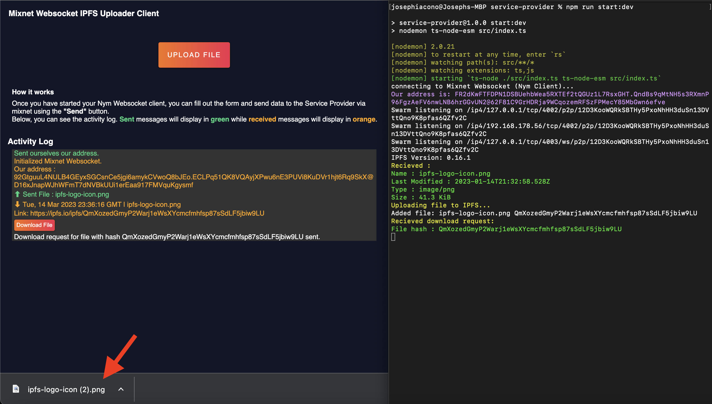

# Implementing Download Functionality

With both the `user-client` and the `service-provider` set up to use IPFS. We'll now create and modify the necessary functions within both source-codes to alow for files we upload to IPFS to be directly donwloaded to our device, via the mixnet!.

## Modifying our User Client

Back in our `index.ts` of our `user-client` code, navigate to your `displayJsonResponse()` function and make the following code changes:
```typescript
function displayJsonResponse(message) {

    const timeElapsed = Date.now();
    const today = new Date(timeElapsed);
    
    let receivedDiv = document.createElement("div");

    let messageLine1 = document.createElement("p");

    let messageLine2 = document.createElement("p");

    messageLine1.setAttribute('style', 'color: orange;word-break: break-word;');
    messageLine2.setAttribute('style', 'color: orange;word-break: break-word;');

    let line1Contents;
    let line2Contents;

    var downloadFileButton = document.createElement("button");

    if (message.type == 'selfAddress'){
        
        ourAddress = message.address;
        line1Contents = document.createTextNode("Initialized Mixnet Websocket.");
        line2Contents = document.createTextNode('Our address : ' + message.address);
    }

    if (message.type == 'received'){

        if(message.downloadableFileData){ // <--- Add this if statement
            executeFileDownload(message.downloadableFileData,message.fileName,message.fileType) // <--- Add code
            return; // <--- Add code
        } else { // <--- Add else
            let dataLog = {
                url : 'https://ipfs.io/ipfs/' + message.fileCid,
                name: message.filePath,
                time : today.toUTCString()
            }

            line1Contents = document.createTextNode("⬇ " + dataLog.time + " | " + dataLog.name);
            line2Contents = document.createTextNode('Link: ' + dataLog.url);

            downloadFileButton.innerHTML = 'Download File';
            downloadFileButton.className = 'download-button'
            downloadFileButton.onclick = function(){sendDownloadRequest(message.fileCid,message.filePath,message.fileType)}
        } // <--- Add closing brace
    }

    messageLine1.appendChild(line1Contents);
    messageLine2.appendChild(line2Contents);
    
    receivedDiv.appendChild(messageLine1);
    receivedDiv.appendChild(messageLine2);

    if (message.type == 'received'){
        receivedDiv.appendChild(downloadFileButton);
    }
    
    document.getElementById("output").appendChild(receivedDiv);
}

```
We added the in the new `if` statement that will be invoked whenever a message that contains a `type` of `"received"` contains a `downloadableFileData` property within the received object. This indicates that we have received back downloadable data from our Service Provider.

To turn that data into something we can download, we'll need to implement the new function that we can see in our above code modifications, `executeFileDownload()`.

At the bottom of our `index.ts`, lets implement this as our last new function for our User Client.

```typescript
async function executeFileDownload(data : any,path : string,type : string){

    const fileName = path;
    var fileBlob : any;

    if(type.startsWith('text')){
        const encoder = new TextEncoder();
        fileBlob = new Blob([encoder.encode(data)], { type: type });
    } else {
        const uint8Array = new Uint8Array(data.data);
        fileBlob = new Blob([uint8Array], { type: type });
    }
    const fileUrl = URL.createObjectURL(fileBlob);

    const downloadLink = document.createElement('a');
    downloadLink.href = fileUrl;
    downloadLink.download = fileName;
    document.body.appendChild(downloadLink);
    downloadLink.click();
    document.body.removeChild(downloadLink);
}
```

* `fileName` - The name of the file that will appear in our device.

* `fileBlob` - The variable that holds the Blob data of the file were going to download.

* `fileUrl` - The temporary URL that will act as the temporary location for our application to download from.

The purpose of this function is to download a file to the user's device. It encodes the data using a `TextEncoder` and creates a blob using that encoded data. After creating the file blob, the function creates a URL object using the `createObjectURL` method, which creates a temporary URL that points to the file blob.

To get the download functionality working, we create a HTML anchor element with that temporary URL as the href attribute, simulating a click on the anchor element to open the file download dialog box, and then removing the anchor element from the body of the document.

## Modifying our Service Provider

We'll be going back into our `index.ts` back in our `service-provider` for the remainder of our code modifications.

The first function we will need to modify is our `handleResponse()` function, as it will be receiving a download request from the user client when the 'Download' button is clicked.

```typescript
function handleResponse(responseMessageEvent : MessageEvent) {
  try {
      let response = JSON.parse(responseMessageEvent.data.toString());
      if (response.type == "error") {
        console.log("\x1b[91mAn error occured: " + response.message + "\x1b[0m")
      } else if (response.type == "selfAddress") {
        ourAddress = response.address;
        console.log("\x1b[94mOur address is: " + ourAddress + "\x1b[0m")
      } else if (response.type == "received") {
        let messageContent = JSON.parse(response.message)

        if(messageContent.fileCid){  // <--- Insert if statement
            console.log('\x1b[93mRecieved download request: \x1b[0m'); // <--- Insert log statement
            console.log('\x1b[92mFile hash : ' + messageContent.fileCid + '\x1b[0m'); // <--- Insert log statement
            getAndSendBackDownloadableFile(messageContent.fileCid,messageContent.fileName,messageContent.fileType,response.senderTag); // <--- Insert code
        } else { // <--- Insert else statement
            console.log('\x1b[93mRecieved : \x1b[0m');
            console.log('\x1b[92mName : ' + messageContent.name + '\x1b[0m');
            console.log('\x1b[92mLast Modified : ' + messageContent.lastModifiedDate + '\x1b[0m');
            console.log('\x1b[92mType : ' + messageContent.type + '\x1b[0m');
            console.log('\x1b[92mSize : ' + readFileSize(messageContent.size) + '\x1b[0m');

            console.log('\x1b[93mUploading file to IPFS... \x1b[0m');

            uploadToIPFS(messageContent,response.senderTag);
        } // <--- Insert closing brace
      }
  } catch (_) {
        console.log('something went wrong in handleResponse');
  }
}

```

If our incoming message has type `"received"` and its content holds the `fileCid` property, the our logic identifies it as a download request. We can pass the files hash (`fileCid`), `fileName` and `fileType` into a new function we are going to implement in this file, `getAndSendBackDownloadableFile()`.

```typescript
async function getAndSendBackDownloadableFile(cid : string,name : string,type : string,senderTag: string){
    let data;

    const stream = ipfsNode.cat(cid)
    
    const chunks = [];
    for await (const chunk of stream) {
        chunks.push(chunk);
    }

    if(type.startsWith('text')){
        data = Buffer.concat(chunks).toString();
    } else {
        data = Buffer.concat(chunks);
    }

    const messageContentToSend = {
        text: 'We received your download request - this reply sent to you anonymously with SURBs',
        fromAddress : ourAddress,
        downloadableFileData : data,
        fileName : name,
        fileType : type
    }
    
    const message = {
        type: "reply",
        message: JSON.stringify(messageContentToSend),
        senderTag: senderTag
    }
    
    // Send our message object via out via our websocket connection.
    websocketConnection.send(JSON.stringify(message));
    
}

```
* `data` - The variable within the function that will hold the files data which we will send back through the mixnet to our User Client.

* `stream` - By using the `cat()` method on the IPFS node, we retrieve the file with the given CID. We assign the resulting file data to this variable.

* `chunks` - We loop through the data within `stream`. For each chunk of data, it pushes it onto the `chunks` array.

The logic checks whether the `type` of the file starts with 'text'. If it does, it concatenates all the chunks of data in the `chunks` array using the `Buffer.concat()` method and converts the resulting buffer data to a string using the `toString()` method. If it doesn't start with 'text', it concatenates the chunks of data in the same way without stringify'ing it. Both paths will assign the result to the `data` variable. 

Once the above logic is completed, we repeat our usual process of sending the data back to the websocket by constructing a our message data, along with its parent message object that we can send back through the mixnet.

## Downloading our File

Ensure that your `user-client` and `service-provider` applications are still running , along with the pair of Nym Websocket Clients, lets try and download a file we uploaded. 

Repeat the process of sending a file to the service provider once again. This time around, click the 'Download' button that appears in the `user-client`'s UI in the browser as a result of receiving back the uploaded files data.



Here, we can see that a message appears on the User Clients UI in the browser notifying us that we have sent the request to the Service Provider. The Service Provider then acknowledges that request and subsequently confirms the files hash (`cid`) before sending the data back to us. If everything has gone according to plan, you'll soon receive a new file download in your browsers download queue/history!


