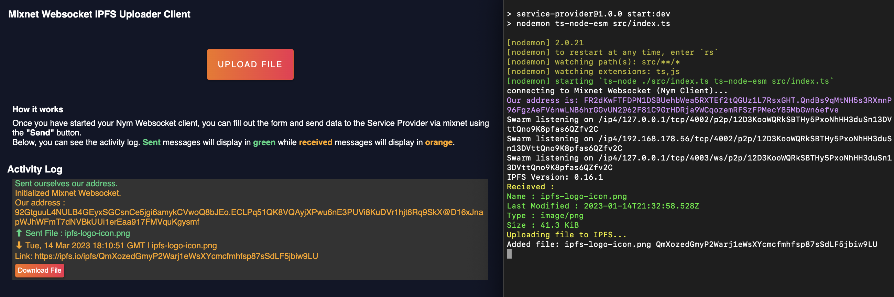

# Sending a File Over the Mixnet

You are now ready to send a file over the mixnet! 

You should have the following set up:

* A __User Client__ Web App 
* A __Service Provider__ backend service 
* 2 Nym websocket clients, one for each component above

Click the 'File Upload' and choose a file to upload. Once selected , the file upload process will begin right away. The __User Client__ will display a message showing the file has been sent , with the __Service Provider__ showing that those details have been received. The SP then uploads the file , return the IPFS related metadata of the uploaded file and sends it back to the UC via a SURB. We can then see the details sent back to our __User Client__, complete with a URL where we can access that file stored on its location on the internet.

With this template application in place at this stage, you should have enough here to enable you to build PEApps that handle the anonymous transfer of files of the internet. 

The next section will take you through how to send a download request from our `user-client` back to our `service-provider`, resulting in that file being sent back to us and downloaded onto our local device. Its time to make use of that Download button!

