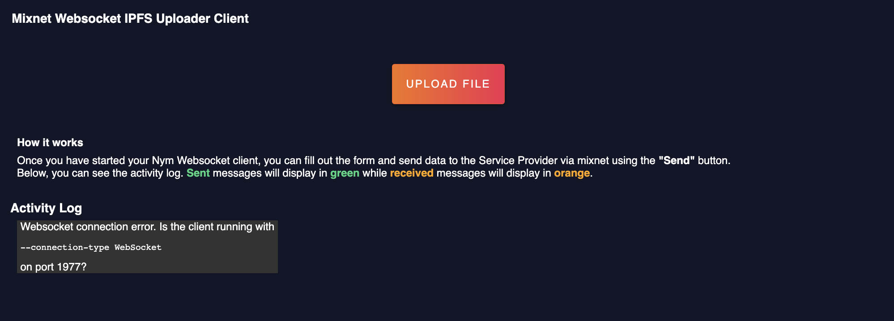
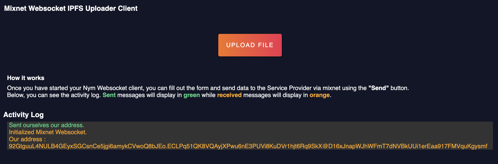

# Modifying Your User Client Code
We already have functions in our existing code that we can modify to implement the logic required to enable our User Client to upload files to the mixnet. This will also involve sorting the data we receive back from the server.

> ⚠️ If you starting this tutorial after pulling the `simple-service-provider-tutorial` code from our `developer-tutorials` GitHub repository, ensure that you run `npm install` to ensure that you install all necessary dependencies before starting.

## Adding our new global variables.

At the top of our `index.ts` file, just above our `main()` function, lets declare two new variables.
```typescript

const fileInput = document.querySelector('#fileInput');

var selectedPayload: any;

```

* `fileInput` - Variable that refers to the HTML element with the ID `fileInput` on the page which will be in the form of a button (to be implemented further down on this page).

* `selectedPayload` - Value that will be populated once a file is selected from clicking our button. The data from this variable will then be uploaded to the mixnet.


## Modyfying our `main()` function.

We will need to replace the references to the `sendButton` variable at the bottom of our `main()` function with a new `addEventListener` method, a member of our `fileInput` variable. This method will execute a new function we will soon create, `onFileChange`, whenever a file is selected via our button.

```typescript

async function main() {
    var port = '1977' // Nym Websocket Client listens on 1977 by default.
    var localClientUrl = "ws://127.0.0.1:" + port;
    
    // Set up and handle websocket connection to our desktop client.
    websocketConnection = await connectWebsocket(localClientUrl).then(function (c) {
        return c;
    }).catch(function (err) {
        displayClientMessage("Websocket connection error. Is the client running with <pre>--connection-type WebSocket</pre> on port " + port + "?");
    })

    websocketConnection.onmessage = function (e) {
        handleResponse(e);
    };
    
    sendSelfAddressRequest();

    /* Remove this code.

        // Set up the send button
        const sendButton = document.querySelector('#send-button');
        
        sendButton?.addEventListener('click', function handleClick(event) {
            sendMessageToMixnet(); 
        });

    */
    
    // Set up the file upload button
    fileInput.addEventListener('change', onFileChange, false); // <--- Insert code.
}

```

## Adding our `onFileChange()` function.

Below our `selfAddressRequest()` function, add the following code: 

```typescript

function onFileChange(){
    selectedPayload = document.getElementById('fileInput').files[0];
    var reader = new FileReader();
    reader.readAsDataURL(document.getElementById('fileInput').files[0]);
    reader.addEventListener('load', readAndSendFile);
}

```
* `onFileChange()` - We instantiate a new instance of a [FileReader](https://developer.mozilla.org/en-US/docs/Web/API/FileReader) which reads the data from the uploaded file. The `addEventListener` function is used to register a callback function, `readAndSendFile()`, which we will implement shortly. It will be invoked when the file data is loaded by the `FileReader`.

Below our `onFileChange()` function, paste in the following function:

```typescript
function readAndSendFile(event) {
    let blobResult = event.target.result
    sendMessageToMixnet(blobResult);
}
```
Inside this function , the `event.target.result` is used to retrieve the contents of the file that was loaded by the `FileReader` we instantiated in the previous function. Once we have that data, were going to prepare to send it to the mixnet!

## Modifying our `sendMessageToMixnet()` function.

Next, were going to make changes to the logic of our `sendMessageToMixnet()` function:

```typescript
function sendMessageToMixnet(payload) { 

    /* Remove this code

    var nameInput = (<HTMLInputElement>document.getElementById("nameInput")).value;
    var textInput = (<HTMLInputElement>document.getElementById("textInput")).value;

    */

    var messageContentToSend  = {
        lastModified: selectedPayload.lastModified,
        lastModifiedDate: selectedPayload.lastModifiedDate,
        name: selectedPayload.name,
        size: selectedPayload.size,
        type: selectedPayload.type,
        dataUrl: payload
   };  
   
    /* Remove this code

    const messageContentToSend = {
        name : nameInput,
        comment : textInput,
    }

    */

    // construct our message object to send to the SP via the mixnet   
    const message = {
        type: "sendAnonymous",
        message: JSON.stringify(messageContentToSend),
        recipient: targetAddress,
        replySurbs: 5
    }
    
    // Display the json data you're sending to the SP on the UI
    displayJsonSend(message);
    
    // Send our message object via out via our websocket connection.
    websocketConnection.send(JSON.stringify(message));
}
```

As we've already assigned the file we want to send to our `selectedPayload` variable, we don't need to access data directly from any HTML elements in our DOM. Make sure that `payload` is inserted as function parameter, then assign that value to the `dataUrl` property of our `messageContentToSend` object.

## Modifying our `displayJsonSend()` function.

```typescript
function displayJsonSend(message){

    let sendDiv = document.createElement("div")
    let paragraph = document.createElement("p")

    paragraph.setAttribute('style', 'color: #36d481');

    /* Remove this code.

    let paragraphContent = document.createTextNode("sent >>> " + JSON.stringify(message))

    */

    let paragraphContent;

    if (message.type == 'selfAddress'){
        paragraphContent = document.createTextNode("Sent ourselves our address.")
    } else {
        let decodedMessage = message.message.replace(/\//g,"");
        
        // After using 'string.replace()' as above, we can turn our data back into an object. This will make it match our attributes defined in the MessageData interface
        let parsedMessage = JSON.parse(decodedMessage);
        paragraphContent = document.createTextNode("⬆ Sent File : " + parsedMessage.name)
    }

    paragraph.appendChild(paragraphContent)
    sendDiv.appendChild(paragraph)
    document.getElementById("output").appendChild(sendDiv)
}
```

We've modified our `displayJsonSend()` function to display a 'nicer' message for our clients UI in the browser. The `paragraphContent` variable will be populated with the `name` of the file we sent in our `sendMessageToMixnet()` function.This message will be displayed on the screen just before the file is sent to our websocket, before entering the mixnet.

## Modifying our `handleResponse()` function.

```typescript
function handleResponse(resp) {

    /* Remove this code.

    try {
        let response = JSON.parse(resp.data);
        if (response.type == "error") {
            displayJsonResponse("Server responded with error: " + response.message);
        } else if (response.type == "selfAddress") {
            ourAddress = response.address;
            displayClientMessage("Our address is:  " + ourAddress);
        } else if (response.type == "received") {
            handleReceivedTextMessage(response)
        }
    } catch (_) {
        displayJsonResponse(resp.data)
    }

    */

    let response = JSON.parse(resp.data);
    if (response.type == "error") {
        displayJsonResponse("Server responded with error: " + response.message);
    } else if (response.type == "selfAddress"){
        displayJsonResponse(response);
    } else if (response.type == "received"){
        handleReceivedTextMessage(response);
    }
}
```

At the top of our `handleResponse()` function, we have simplified it to a cleaner series of if-else statements. This block of code eliminates the need for error handling in the `displayJsonResponse()` function, which we're going to modify after we have made a small modification to our `handleReceivedTextMessage()` function.

## Modifying our `handleReceivedTextMessage()` function.

```typescript

function handleReceivedTextMessage(message) {
    const text = JSON.parse(message.message);

    let sortedMessage = { // <--- Add new object 
        type : message.type,
        ...text
    }

    displayJsonResponse(sortedMessage); // <--- Replace parameter
}
```

Here, we modify the data that we receive (as type `"recieved"`) so that were only passing the necessary data to the next function, `displayJsonResponse()`.

## Modifying our `displayJsonResponse()` function.

Replace the contents of our  `displayJsonResponse()` function with the following code.

```typescript

function displayJsonResponse(message) {

    /* Remove this code.
    
        let receivedDiv = document.createElement("div")
        let paragraph = document.createElement("p")
        paragraph.setAttribute('style', 'color: orange')
        let textNode = document.createTextNode("received >>> " + message.text)
        paragraph.appendChild(textNode)
        
        receivedDiv.appendChild(paragraph)
        document.getElementById("output").appendChild(receivedDiv)

    */


    //Variables that will get us the date and time value of when we receive the uploaded file. 
    const timeElapsed = Date.now();
    const today = new Date(timeElapsed);
    
    let receivedDiv = document.createElement("div");
    //Our olf variable in the SSP - `paragraph` becomes messageLine1
    let messageLine1 = document.createElement("p");
    //We add another line so we have extra space for additional useful information pertaining to our received data.
    let messageLine2 = document.createElement("p");

    //Setting the styling of our lines.
    messageLine1.setAttribute('style', 'color: orange;word-break: break-word;');
    messageLine2.setAttribute('style', 'color: orange;word-break: break-word;');

    //Declare two variables that will hold message data, ready to be populated based on the type when it enters the logic below.
    let line1Contents;
    let line2Contents;

    //Creating our download button that will be displayed after successfully processing the response that is sent back from the server.
    var downloadFileButton = document.createElement("button");

    if (message.type == 'selfAddress'){
        //Display our self address.
        ourAddress = message.address;
        line1Contents = document.createTextNode("Initialized Mixnet Websocket.");
        line2Contents = document.createTextNode('Our address : ' + message.address);
    }

    if (message.type == 'received'){
        
        //Creating a data log object to display on our UI
        let dataLog = {
            url : 'https://ipfs.io/ipfs/' + message.fileCid,
            name: message.filePath,
            time : today.toUTCString()
        }

        line1Contents = document.createTextNode("⬇ " + dataLog.time + " | " + dataLog.name);
        line2Contents = document.createTextNode('Link: ' + dataLog.url);

        downloadFileButton.innerHTML = 'Download File';
        downloadFileButton.className = 'download-button'
        downloadFileButton.onclick = function(){sendDownloadRequest(message.fileCid,message.filePath,message.fileType)}
        
    }

    messageLine1.appendChild(line1Contents);
    messageLine2.appendChild(line2Contents);
    
    receivedDiv.appendChild(messageLine1);
    receivedDiv.appendChild(messageLine2);

    if (message.type == 'received'){
        receivedDiv.appendChild(downloadFileButton);
    }
    
    document.getElementById("output").appendChild(receivedDiv);
}

```

* `timeElapsed` & `today` - We assign `timeElapsed` to `Date.now()` (a large number representing milliseconds elapsed since epoch time) and use it to assign it to `today`, a new date value that we use to display a timestamp on the UI when the response is received back from the server.

* `downloadFileButton` - To round off this User Client application, we will want to be able to download the file from the Service Provider if we get a successful response from it after sending the file through the mixnet. Inside our function,after creating a `dataLog` object, we will assign an `onclick` function to it. You can see we pass the file's hash (`fileCid`) along with its `path` and `type` as parameters.

Below our `displayJsonResponse()` function , paste the following code for our new function, `sendDownloadRequest()` below.

```typescript

function sendDownloadRequest(cid : string, path : string,type : string){
    
    var messageContentToSend  = {
        fileCid : cid,
        fileName : path,
        fileType : type
   };  
   
   /*We have to send a string to the mixnet for it to be a valid message , so we use JSON.stringify to make our object into a string.*/
   const message = {
       type: "sendAnonymous",
       message: JSON.stringify(messageContentToSend),
       recipient: targetAddress,
       replySurbs: 5
   }
   
   displayClientMessage('Download request for file with hash ' + cid + ' sent.');

   //Send our message object via out via our websocket connection.
   websocketConnection.send(JSON.stringify(message));
   
}
```
We will re-visit the download file functionality of User Client in a later section of the tutorial.  

## Modifying our `index.html` file.

In your `index.html` file of our `user-client` , were just going to make some small changes. The main change here is adding our file upload `input`, with the ID of `fileInput` element,  which we have already referenced in our `index.ts` at the top of this tutorial page. This will resemble the visual form of a button in our browser screen.

```html
<!doctype html>
<html>
    <head>
        <meta charset="UTF-8">
        <!-- <title>Mixnet Websocket Starter Client</title>  // Remove this line -->
        <title>Mixnet Websocket IPFS Uploader Client</title>
        <link rel="stylesheet" href="../assets/styles.css"/>
    </head>
    <body>
        <div class="content" role="main">
            <div class="toolbar">
                <!-- <title>Mixnet Websocket Starter Client</title>  // Remove this line -->
                <h3>Mixnet Websocket IPFS Uploader Client</h3>
            </div>
            
            <div class="section-container">

                <!-- Remove this code.
                
                <label for="nameInput" class="form-field-label">Moniker</label>
                <input id="nameInput" type="text" value="An0n" name="nameInput">

                <label for="textInput" class="form-field-label">Comment</label>
                <input id="textInput" type="text" value="I would like to use your private service" name="textInput">
         
                <div id="send-button">
                    <label for="send-button" class="submit-button">Send</label>
                </div> 
                
                -->
                
                <div class="file-upload">
                    <label for="fileInput" class="file-upload-label">UPLOAD FILE</label>
                    <input id="fileInput" class="file-upload-input" type="file"/>
                </div>
         
            </div>
        </div>
        
        <div class="" style="margin-left:20px;max-width: fit-content;">
            <div style="color: white;margin-bottom: 2rem;">
                <h4>How it works</h4>
                <p>Once you have started your Nym Websocket client, you can fill out the form and send data to the Service Provider via mixnet using the <b>"Send"</b> button.</p>
                <p>Below, you can see the activity log. <b style='color: #36d481;'>Sent</b> messages will display in <b style='color: #36d481;'>green</b> while <b style='color: orange;'>received</b> messages will display in <b style='color: orange;'>orange</b>.</p>
            </div>
        </div>
        
        <h3 style="margin-left:10px">Activity Log</h3>
        
        <p class="output-container">
            <span id="output"></div>
        </p>

        <script src="index.ts"></script>
    </body>
</html>
```

For our new button , we also have some new styles that you can use if you wish to do so. At the bottom of your stylesheet file (found in `assets/styles.css`) paste the following code at the bottom of the file :

```css
/* Download Button Styles */

.file-upload-label {
    box-shadow: 0 1.5px 4px rgba(0, 0, 0, 0.24), 0 1.5px 6px rgba(0, 0, 0, 0.12);
    background:linear-gradient(90deg, #f4731b 1.05%, #f12d50 100%);
    border: 1px solid #F4511E;
    border-radius: 4px;
    cursor: pointer;
    color: #fff;
    display: inline-block;
    float: left;
    letter-spacing:2px;
    text-transform: uppercase;
    padding:20px;
    margin: auto;
}
    
.file-upload-input {
    position: absolute;
    left: 0;
    top: 0;
    right: 0;
    bottom: 0;
    font-size: 1px;
    width: 0;
    height: 100%;
    opacity: 0;
}

.download-button {
    box-shadow: 0 1.5px 4px rgba(0, 0, 0, 0.24), 0 1.5px 6px rgba(0, 0, 0, 0.12);
    background:linear-gradient(90deg, #f4731b 1.05%, #f12d50 100%);
    border: 1px solid #F4511E;
    border-radius: 4px;
    cursor: pointer;
    color: #fff;
    display: inline-block;
    padding:5px;
    margin-top: 5px;
    margin-bottom: 5px;
}
```
## Running our application and connecting our Nym Client.

Ensure that you have a terminal open in the `user-client` directory , lets go ahead and start the application:

```
npm start
```

Open your browser and navigate to [localhost:1234](http://localhost:1234/) and you should see an updated UI.  



Just as another reminder , you can follow instructions in the [Nym websocket client documentation](https://nymtech.net/docs/clients/websocket-client.html#initialising-your-client) to `init` and `run` a `nym-client`.

Once again, you can refresh your browser window to see your websocket connect to it: 



At this point , were ready to modify the code of our Service Provider in order to reflect the changes we have made to our User Client.
