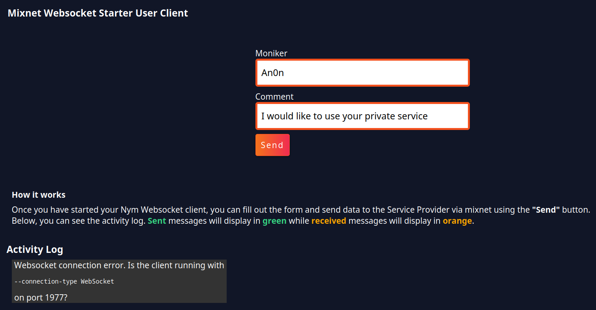

# Building a Simple Service Provider

In this guide, developers will learn about the powerful technology offered by Nym, which allows for the creation of applications that prioritize user privacy through the use of mixnet technology.

<!-- You can watch the step-by-step guide on creating your own Simple Service Provider [here](): -->

<iframe width="700" height="400"  src="https://www.youtube.com/watch?v=UYn8nGFtdpg" title="YouTube video player" frameborder="0" allow="accelerometer; autoplay; clipboard-write; encrypted-media; gyroscope; picture-in-picture; web-share" allowfullscreen></iframe>

#### What are we building?

In this tutorial, you will learn how to build two essential components for sending messages through the mixnet:

- A User Client written in TypeScript, which allows for accessing the mixnet through a browser on a local machine.
- A Service Provider also written in TypeScript, which can receive messages from the mixnet.
- Additionally, you will be guided on how to configure a pair of Nym Websocket Clients, which are necessary for connecting to the mixnet with your application.

> ⚠️ Service providers are usually run on remote servers to keep metadata private, but for demonstration purposes, this tutorial will show how to run it on a local machine using looped messages through the mixnet.


We'll dive into the process of creating a Typescript application from the ground up. We'll cover how to set up a Nym Websocket Client and connect it to the mixnet, as well as the necessary steps to send a properly formatted message through the mixnet to the Service Provider. Don't fret if your skills in Javascript or Typescript are a bit rusty, there will be plenty of code snippets to copy and paste along the way.

To assist in your learning, the complete code for this tutorial is available on [Github](https://github.com/nymtech/developer-tutorials). You can use it as a reference while building or simply download it and follow along as you progress through the tutorial."

#### What do we want to achieve?

We aim to create a user-friendly experience for sending data through the mixnet. The User Client will present a simple form accessible through a web browser, where users can enter their data. Once the form is completed, users can press a 'Send' button which will transmit the data straight to the Service Provider via the mixnet. The sent data will be visible within the user interface of the Service Provider, which can also be accessed through a web browser.

#### What is a Service Provider
'Service Providers' are the name given to any type of app that can communicate with the mixnet via a Nym Client. The [Network Requester](https://nymtech.net/docs/nodes/network-requester-setup.html) is an app that takes an outbound network request from the mixnet, performs that request (e.g. authenticating with a message server and recieving new messages) and then passes the response back to the user who requested it, sheilding their metadata from the message server. 

The Service Provider covered in this tutorial is far more simple than this, as it just aims to show developers how to approach building something that can:
* connect to the mixnet, 
* listen for messages, and 
* perform some action with them (in this case, show them on a UI). 

### Prerequisites
* `node` & `npm` 
* `Typescript` 

#### Preparing your TypeScript environment  

Make a new directory called `simple-service-provider-tutorial` and inside it create another folder named `user-client`.

Continue to then do the following:

1.  `path/to/the/user-client` folder you created, and run:

    ```
    npm init
    ```
Continue just press enter after each prompt to confirm the configuration.

<details>
    <summary>Console Output</summary>
       
        This utility will walk you through creating a `package.json` file.
        It only covers the most common items, and tries to guess sensible defaults.

        See `npm help init` for definitive documentation on these fields
        and exactly what they do.

        Use `npm install <pkg>` afterwards to install a package and
        save it as a dependency in the package.json file.

        Press ^C at any time to quit.
        package name: (user-client)
        version: (1.0.0)
        description:
        entry point: (index.js)
        test command:
        git repository: 
        keywords:
        author: 
        license: (ISC) 
        About to write to path/to/directory/user-client/package.json:

        {
            "name": "user-client",
            "version": "1.0.0",
            "description": "",
            "main": "index.js",
            "scripts": {
                "test": "echo \"Error: no test specified\" && exit 1"
            },
            "author": "",
            "license": "ISC"
        }

        Is this OK? (yes) 
</details>

A `package.json` file has been created in the folder.

 2. Then in the same terminal, run:
    
    ```
    npm install typescript
    ```
After the installation has been completed, check to see that the typescript dependencies have been added. The `package.json` file should look like this:

    {
        "name": "user-client",
        "version": "1.0.0",
        "description": "",
        "main": "index.js",
        "scripts": {
            "test": "echo \"Error: no test specified\" && exit 1"
        },
        "author": "",
        "license": "ISC",
        "dependencies": {
            "typescript": "^4.9.3"
        }
    }
    

 3. Now run in your terminal:
    
```
npm install ts-node --save-dev
```
The package (`ts-node`) allows us to build a typescript application in a node environment.

 4. Create a new file in the `user-client` folder called `tsconfig.json`. Paste the following code into the file:

    ```
    {
        "compilerOptions": {
            "module": "commonjs",
            "esModuleInterop": true,
            "target": "es6",
            "moduleResolution": "node",
            "sourceMap": true,
            "outDir": "dist"
        },
        "lib": ["es2015"]
    }
    ```

#### Bundling the Application

 To build and run our application locally, we require a tool that allows us to work on it while it's running and instantly reflects saved changes on the browser.

1. This can be achieved through the installation of Parcel bundler using the following command in your terminal window:

```
npm install --global parcel-bundler
```

After completing the installation process, start by creating a `src` folder within the `user-client` folder. Within this `src` folder, create two new files:
* `index.html` 
* `index.ts`


 2. Paste the following the `index.html`:
    
    ```
    <!DOCTYPE html>
    <html>
        <head>
            <title>App Test</title>
            <meta charset="utf-8"/>
        </head>
        <body>
            <h1>Test</h1>
            <div id="app"></div>
            <script src="index.ts"></script>
        </body>
    </html>

    ```

    And in the `index.ts`:

    ```
    console.log('test log')
    ```

This will ensure that our TypeScript file is functional when the application is launched in the browser.
    
3. Navigate to the `package.json` file and in the `"scripts"` array, add the following above `"test"`:

```
"start": "parcel src/index.html"
```

Now back in our terminal , run `npm start`.


Open your browser at [localhost:1234](http://localhost:1234/). 

Your web application is now up and running with `Test` displayed on the browser window.

Checking the `console.log` output is done by right-clicking on the browser and selecting __Inspect__, then navigating to the __Console__ section of the resulting panel. You should see the message `test log` displayed there.

    
### Building the User Client

Building our __User Client__ focuses mainly on configuring and adding functions to `index.ts` file, in the `user-client` folder. It's where we establish the connection between our application and the mixnet, create the messages we want to send, and then send them to a service provider through the mixnet. 

Therefore we must implement the functions that connects our Typescript Client to our Nym Websocket client.

 1. Replace the existing content of the `index.ts` file in the `user-client` folder with this function: 
    
    ```
    async function main() {
    }

    function connectWebsocket(url) {
        return new Promise(function (resolve, reject) {
            var server = new WebSocket(url);
            console.log('connecting to Websocket Server (Nym Client)...')
            server.onopen = function () {
                resolve(server);
            };
            server.onerror = function (err) {
                reject(err);
            };
        
        });
    }
    
    main();
    ```
* `main()` - This first function will hold the majority of the logic and initiate the connection with the Nym Websocket Client. It's best to declare it at the start of the file and call it at the end to run when launching the application.

* `connectWebsocket(url)` - In this function, we return a Promise that tries to set up a websocket connection to the url we provide as a parameter. If the connection is successful, we will get a notification in our application and websocket client. If it fails, we'll receive an error in our app. 

 2. Next, implement the functions that will handle DOM (Document Object Model) manipulation allowing the alteration of the UI depending on our interaction with the application.
    
Before the `main()` declaration at the end of the file, add the following:
 
```
    function displayClientMessage(message) {
        document.getElementById("output").innerHTML += "<p>" + message + "</p >";
    }
    
    function handleResponse(resp) {
        try {
            let response = JSON.parse(resp.data);
            if (response.type == "error") {
                displayJsonResponse("Server responded with error: " + response.message);
            } else if (response.type == "selfAddress") {
                displayJsonResponse(response);
                ourAddress = response.address;
                displayClientMessage("Our address is:  " + ourAddress + ", we will now send messages to ourself.");
            } else if (response.type == "received") {
                handleReceivedTextMessage(response)
            }
        } catch (_) {
            displayJsonResponse(resp.data)
        }
    }
    
    function handleReceivedTextMessage(message) {
        const text = message.message
        displayJsonResponse(text)
    }
    
    function displayJsonResponse(message) {
        let receivedDiv = document.createElement("div")
        let paragraph = document.createElement("p")
        paragraph.setAttribute('style', 'color: orange')
        let paragraphContent = document.createTextNode("received back >>> " + JSON.stringify(message))
        paragraph.appendChild(paragraphContent)
        
        receivedDiv.appendChild(paragraph)
        document.getElementById("output").appendChild(receivedDiv)
    }

```

The majority of this code is required for adjusting the elements of the `index.html`. 

3.  Above our `main()` function, add the following code:

```
var ourAddress : string;

var targetAddress: string;

var websocketConnection: any;
```

These variables are the main global variables of our application.

* `ourAddress` - Automatically filled in upon receipt of a reply from the Nym Websocket client's initialization.

* `targetAddress` - A manually set parameter for the Service Provider's Nym client.

* `websocketConnection` - Populated upon a successful response from our Promise within the `connectWebsocket()` function.

4.  Back inside the `main()` function, add the following:
  
```
    async function main() {
        var port = '1977' // client websocket listens on 1977 by default.
        var localClientUrl = "ws://127.0.0.1:" + port;
        
        websocketConnection = await connectWebsocket(localClientUrl).then(function (c) {
            return c;
        }).catch(function (err) {
            displayClientMessage("Websocket connection error. Is the client running with <pre>--connection-type WebSocket</pre> on port " + port + "?");
        })

        websocketConnection.onmessage = function (e) {
            handleResponse(e);
        };
        
        sendSelfAddressRequest();
        
        const sendButton = document.querySelector('#send-button');
        
        sendButton?.addEventListener('click', function handleClick(event) {
            sendMessageToMixnet(); 
        });
    }

```

5. Currently the `sendSelfAddressRequest()` has not been defined. Add the following under between the `main()` and `displayClientMessage()` functions:

```
    function sendSelfAddressRequest() {
        var selfAddress = {
            type: "selfAddress"
        }
        displayJsonSend(selfAddress);
        websocketConnection.send(JSON.stringify(selfAddress));
    }

```

* `sendSelfAddressRequest()` - Function that retrieves the websocket address and displays it on the browser's UI after connecting to the websocket.

Recap: So far, our added logic into our `main()` function will do the following:

* State the port (set to `1977`, which our Websocket Client listens to by default) and local client url (which we point to `localhost` (`127.0.0.1`)).
* Called our `connectWebsocket()` function and assign the value it returns to `websocketConnection`.
* Implemented the handling of any responses retrieved from the websocket, dependent of the value in the type attribute within the `handleResponse()` function.
* Added the `sendSelfAddressRequest()` function which sends a object with an attribute type of `selfAddress` that retrieves the address of the Websocket Client.
* Initially built `Send` button function which will purposely grab the sent data.

6. Underneath the `sendSelfAddressRequest()` function, add the following:

```
    function sendMessageToMixnet() {
    
        var nameInput = (<HTMLInputElement>document.getElementById("nameInput")).value;
        var serviceSelect = (<HTMLInputElement>document.getElementById("serviceSelect")).value;
        var textInput = (<HTMLInputElement>document.getElementById("textInput")).value;
        var freebieCheck = (<HTMLInputElement>document.getElementById("freebieCheck")).checked;
        
 
        const messageContentToSend = {
            name : nameInput,
            service : serviceSelect,
            comment : textInput,
            gift : freebieCheck
        }

        const message = {
            type: "send",
            message: JSON.stringify(messageContentToSend),
            recipient: targetAddress,
            withReplySurb: false,
        }
        displayJsonSend(message);
        
        websocketConnection.send(JSON.stringify(message));
    }

```

* `sendMessageToMixnet()` - The key function that will allow our Service Provider messages to receive messages. Firstly, it will gets the values from a form in the `index.html` and assign them to local variables within the function, inserting the local variables into one object to be sent to the mixnet. Secondly, calling the `displayJsonSend()` function to render the sent message on to the UI. Lastly, the `websocketConnection` global variable will send our message to the websocket. 

The JSON.stringify our the data when passing to the `send()` function, because the Nym Websocket client only accepts messages in string format and will throw an error if it receives a non-string value.

7. Below our `sendMessageToMixnet()` function, add the following:

```
    function displayJsonSend(message) {
        let sendDiv = document.createElement("div")
        let paragraph = document.createElement("p")
        paragraph.setAttribute('style', 'color: #36d481')
        let paragraphContent = document.createTextNode("sent >>> " + JSON.stringify(message))
        paragraph.appendChild(paragraphContent)
        
        sendDiv.appendChild(paragraph)
        document.getElementById("output").appendChild(sendDiv)
    }
```

* `displayJsonSend(message)` - Will show the message in the "Activity Log" section of the UI.

8. Replace the current `index.html` with the following, to reflect our output on the UI:

```
        <!doctype html>
        <html>
            <head>
                <style>
                    .headerContainer{
                        align-items: end;
                        display: flex;
                        margin-left: 10px;
                        margin-top: 10px;
                        margin-bottom: 20px;
                    }
                    .container{
                        width: 400px;
                        margin-left: 20px;
                    }
                    </style>
                <meta charset="UTF-8">
                <title>Mixnet Websocket Starter Client</title>
                <link rel="stylesheet" href="https://cdnjs.cloudflare.com/ajax/libs/semantic-ui/2.5.0/semantic.min.css" integrity="sha512-KXol4x3sVoO+8ZsWPFI/r5KBVB/ssCGB5tsv2nVOKwLg33wTFP3fmnXa47FdSVIshVTgsYk/1734xSk9aFIa4A==" crossorigin="anonymous" referrerpolicy="no-referrer" />
            </head>
            <body>
                <div class="headerContainer">
                    
                    <h1 style="margin-left: 10px;margin-top: 20px">Mixnet Websocket Starter User Client</h1>
                </div>
                
                <div class="container">
                    <form class="ui form">
                        <div class="field">
                            <label>Name</label>
                            <input type="text" id="nameInput" name="nameInput" value="Freddy">
                            </div>
                        <div class="field">
                            <label>Service</label>
                            <select class="ui dropdown" id="serviceSelect" name="serviceSelect">
                            <option value="service_1">Service 1</option>
                            <option value="service_2">Service 2</option>
                            <option value="service_3">Service 3</option>
                            </select>
                        </div>
                        <div class="field">
                            <label>Message</label>
                            <input type="text" id="textInput" name="textInput" value="Hello, Service Provider. I would like to use a service!">
                        </div>
                        <div class="field">
                            <div class="ui checkbox">
                            <input type="checkbox" id="freebieCheck" name="freebieCheck">
                            <label for="checkbox"> Send me free stuff.</label>
                            </div>
                        </div>
                    </form>
                    <div class="field" style="margin-top: 10px;">
                        <button class="ui button" id="send-button"><i class="icon location arrow"></i>Send</button>
                    </div>
                </div>
                
                <div class="ui icon message" style="margin-left:20px;max-width: fit-content;">
                    <i class="question circle icon"></i>
                    <div class="content">
                        <div class="header">
                            How it works
                            </div>
                            <p>Once you have started your Nym Websocket client(s), you can fill out the form and send data to the mixnet using the <b>"Send"</b> button.</p>
                            <p>Your message will then be relayed through your Nym Websocket client running on the port (specified using --port in the command line) which is set to 1977 by default.</p>
                            <p>Below, you can see the activity log. <b style='color: #36d481;'>Sent</b> messages will display in <b style='color: #36d481;'>green</b> while <b style='color: orange;'>received</b> messages will display in <b style='color: orange;'>orange</b>.</p>
                    </div>
                </div>
                
                <h3 style="margin-left:10px">Activity Log</h3>
                
                <p style="background-color: #202124;color: #fff;">
                    <span id="output"></div>
                </p>
                <script src="https://cdnjs.cloudflare.com/ajax/libs/jquery/3.6.1/jquery.min.js" integrity="sha512-aVKKRRi/Q/YV+4mjoKBsE4x3H+BkegoM/em46NNlCqNTmUYADjBbeNefNxYV7giUp0VxICtqdrbqU7iVaeZNXA==" crossorigin="anonymous" referrerpolicy="no-referrer"></script>
                <script src="https://cdnjs.cloudflare.com/ajax/libs/semantic-ui/2.5.0/semantic.min.js" integrity="sha512-Xo0Jh8MsOn72LGV8kU5LsclG7SUzJsWGhXbWcYs2MAmChkQzwiW/yTQwdJ8w6UA9C6EVG18GHb/TrYpYCjyAQw==" crossorigin="anonymous" referrerpolicy="no-referrer"></script>
                <script src="index.ts"></script>
            </body>
        </html>

    </details>
```

> ⚠️ Make sure to save all files before proceeding!

9. Return back to your terminal and run:

```
npm start
```

Return to your open browser and you should see a new UI has been created for your User Client application.

### Connecting the Nym Websocket Client

This far into the tutorial, we should have functioning User Client to make the initial websocket connection that we're looking for. To connect our Nym Websocket client, go to [releases page](https://github.com/nymtech/nym/releases) to doewnload the latest binaries release of the `nym-client`. Alternatively, download [here](https://nymtech.net/docs/stable/run-nym-nodes/build-nym/) and follow instructions to build the binaries from the monorepo. Once the `nym-client` latest binaries has been downloaded, we can begin connecting and executing of our websocket functionality.  

1. Open a new terminal window, and `path/to/the/release` folder, and run the following to initialize your first `nym-client`:

```
./nym-client init --id websocket-client
```
<details>
    <summary>Console Output</summary>
       
          _ __  _   _ _ __ ___
         | '_ \| | | | '_ \ _ \
         | | | | |_| | | | | | |
         |_| |_|\__, |_| |_| |_|
                |___/

                 (client - version 1.1.4)

        
    Initialising client...
    Client "websocket-client" was already initialised before! Config information will be overwritten (but keys will be kept)!
    Not registering gateway, will reuse existing config and keys
     2023-01-30T09:22:11.446Z INFO  config > Configuration file will be saved to "/Users/oliveranyanwu_nym_tech/.nym/clients/websocket-client/config/config.toml"
    Saved configuration file to "/Users/oliveranyanwu_nym_tech/.nym/clients/websocket-client/config/config.toml"
    Using gateway: 5Ao1J38frnU9Rx5YVeF5BWExcnDTcW8etNe9W2sRASXD
    Client configuration completed.

    Version: 1.1.4
    ID: websocket-client
    Identity key: 5hjx1NGdGfd4rGDPfB2r8E85dEVZ6vgy135fP3nMuWWM
    Encryption: LwnvsnVzwUCMxxLM8e6HZ395pSPc9NDdmCXtHHVMfCG
    Gateway ID: 5Ao1J38frnU9Rx5YVeF5BWExcnDTcW8etNe9W2sRASXD
    Gateway: ws://178.18.240.56:9001
    Client listening port: 1977

    The address of this client is: 5hjx1NGdGfd4rGDPfB2r8E85dEVZ6vgy135fP3nMuWWM.LwnvsnVzwUCMxxLM8e6HZ395pSPc9NDdmCXtHHVMfCG@5Ao1J38frnU9Rx5YVeF5BWExcnDTcW8etNe9W2sRASXD

</details>

> ⚠️ The client address generated by executing a command in a terminal will always be unique and distinct from the address generated by any other client executing the same command.

2. Run the `nym-client` using:

```
./nym-client run --id websocket-client 
```
<details>
    <summary>Console Output</summary>

          _ __  _   _ _ __ ___
         | '_ \| | | | '_ \ _ \
         | | | | |_| | | | | | |
         |_| |_|\__, |_| |_| |_|
                |___/

                 (client - version 1.1.4)

        
     2023-01-30T09:28:52.773Z INFO  client_core::client::base_client::non_wasm_helpers > loading existing surb database
     2023-01-30T09:28:52.775Z INFO  client_core::client::replies::reply_storage::backend::fs_backend::manager > Database migration finished!
     2023-01-30T09:28:52.776Z ERROR client_core::client::replies::reply_storage::backend::fs_backend          > the client hasn't undergone through graceful shutdown the last time it's gone down - we can't trust its reply surbs or stored encryption keys. They shall get purged
     2023-01-30T09:28:52.777Z INFO  client_core::client::replies::reply_storage::backend::fs_backend          > it's been over 6 days and 163 hours since we last used our data store. our reply surbs are already outdated - we're going to purge them now.
     2023-01-30T09:28:52.778Z INFO  client_core::client::replies::reply_storage::backend::fs_backend          > it's been over 6 days and 163 hours since we last used our data store. our reply keys are already outdated - we're going to purge them now.
     2023-01-30T09:28:52.778Z INFO  client_core::client::replies::reply_storage::backend::fs_backend          > it's been over 6 days and 163 hours since we last used our data store. our used sender tags are already outdated - we're going to purge them now.
     2023-01-30T09:28:52.779Z INFO  client_core::client::base_client                                          > Starting nym client
     2023-01-30T09:28:52.956Z INFO  gateway_client::client                                                    > the gateway is using exactly the same protocol version as we are. We're good to continue!
     2023-01-30T09:28:52.960Z INFO  client_core::client::base_client                                          > Obtaining initial network topology
     2023-01-30T09:28:54.077Z INFO  client_core::client::base_client                                          > Starting topology refresher...
     2023-01-30T09:28:54.077Z INFO  client_core::client::base_client                                          > Starting received messages buffer controller...
     2023-01-30T09:28:54.077Z INFO  client_core::client::base_client                                          > Starting mix traffic controller...
     2023-01-30T09:28:54.077Z INFO  client_core::client::base_client                                          > Starting real traffic stream...
     2023-01-30T09:28:54.077Z INFO  client_core::client::base_client                                          > Starting loop cover traffic stream...
     2023-01-30T09:28:54.077Z INFO  nym_client::client                                                        > Starting websocket listener...
     2023-01-30T09:28:54.077Z INFO  nym_client::websocket::listener                                           > Running websocket on "127.0.0.1:1977"
     2023-01-30T09:28:54.077Z INFO  nym_client::client                                                        > Client startup finished!
     2023-01-30T09:28:54.077Z INFO  nym_client::client                                                        > The address of this client is: 5hjx1NGdGfd4rGDPfB2r8E85dEVZ6vgy135fP3nMuWWM.LwnvsnVzwUCMxxLM8e6HZ395pSPc9NDdmCXtHHVMfCG@5Ao1J38frnU9Rx5YVeF5BWExcnDTcW8etNe9W2sRASXD

</details>

The Websocket Client for our Typescript Script is now up and running, and we can refresh the browser application to see the changes. In the 'Activity Log' of the UI, there's a successful response from our websocket, thus we're able to see the same address from our terminal. If we were to terminate our `nym-client`, we can an error on the browser UI stating a missing websocket connection. This is a good sign of error handling.

We can now rerun the same `nym-client`.

### Adding our Service Provider

To completing the full cycle of the websocket functionality, we must create the Service Provider. 

From the [Preparing your Typescript environment](#preparing-your-typescript-environment) section of tutorial guide, repeat the steps `1-4` and step `1` of [Bundling the Application](#bundling-the-application) for adding the __Service Provider__.

> ⚠️ Remember to reference this section of the tutorial to the `service-provider`, instead of `user-client`.  

Begin by creating a `service-provider` folder in the `simple-service-provider-tutorial` root directory.

Navigate to the `package.json` file and in the `"scripts"` array, add the following above `"test"`:

```
"start": "parcel src/index.html --port 1235",
```

By stating the `--port 1235`, it ensures it runs on `localhost:1235` instead of the its User Clients `localhost:1234`, to prevent any conflicting errors.

#### Service Provider Typescript Code

Add the following block of functions and variable into the `index.ts`:

```
    interface MessageData {
        name : string;
        service : string;
        comment : string;
        gift : boolean;
    }

    interface MixnetMessage {
        message : string;
        replySurb : boolean; // Marked when we want to use a 'Single Use Reply Block', a distinct piece of functionality on the mixnet.
        type : string // 'sent' or 'received'
    }

    var ourAddress : string;
    var websocketConnection : any;
    var recievedMessageData : string[] = [];

    async function main() {
        var port = '1978' // client websocket listens on 1977 by default, change if yours is different
        var localClientUrl = "ws://127.0.0.1:" + port;

        websocketConnection = await connectWebsocket(localClientUrl).then(function (c) {
            return c;
        }).catch(function (err) {
            display("Websocket connection error. Is the client running with <pre>--connection-type WebSocket</pre> on port " + port + "?");
        })

        websocketConnection.onmessage = function (e) {
            handleResponse(e);
        };

        sendSelfAddressRequest();
    }

    function decodeStringifiedMessage(message : string){
        let parsedMessage : MessageData;
        
        message = message.replace(/\//g,"");

        interface
        parsedMessage = JSON.parse(message);

        return '<b>Name: </b>' + parsedMessage.name + ' , <b>Service: </b>' + parsedMessage.service + ' ,<b> Personal Comment: </b>' + parsedMessage.comment + ' , <b>Wants Free Stuff?: </b>' + translateYesOrNo(parsedMessage.gift)
    }

    function translateYesOrNo(result : boolean){
        if(result == true) return 'Yes';
        return 'No';
    }

    function renderMessageList(){

        var str = '<ul>'

        recievedMessageData.forEach(function(message) {
        str += ' <div class="item"><i class="check circle icon" style="color:orange"></i>'+ message + '</div>';
        }); 

        str += '</ul>';
        document.getElementById("slideContainer").innerHTML = str;
    }

    function handleResponse(responseMessageEvent : MessageEvent) {
        try {
            let response = JSON.parse(responseMessageEvent.data);
            if (response.type == "error") {
                displayJsonResponseWithoutReply("Server responded with error: " + response.message);
            } else if (response.type == "selfAddress") {
                displayJsonResponseWithoutReply(response);
                ourAddress = response.address;
                display("Our address is:  " + ourAddress);
            } else if (response.type == "received") {
                handleReceivedMessage(response)
            }
        } catch (_) {
            displayJsonResponseWithoutReply(responseMessageEvent.data)
        }
    }

    function handleReceivedMessage(message : MixnetMessage) {
        const text = message.message
        
        displayJsonResponseWithoutReply(text)

        recievedMessageData.push(decodeStringifiedMessage(text));

        renderMessageList();
    }

    function sendSelfAddressRequest() {
        var selfAddress = {
            type: "selfAddress"
        }
        websocketConnection.send(JSON.stringify(selfAddress));
    }

    function display(message : string) {
        console.log('in display');
        console.log(message);
        document.getElementById("output").innerHTML += "<p>" + message + "</p >";
    }

    function displayJsonResponseWithoutReply(message : string) {
        let receivedDiv = document.createElement("div")
        let paragraph = document.createElement("p")

        paragraph.setAttribute('style', 'color: orange')
        let paragraphContent = document.createTextNode("received >>> " + JSON.stringify(message))
        paragraph.appendChild(paragraphContent)

        receivedDiv.appendChild(paragraph)
        document.getElementById("output").appendChild(receivedDiv)
    }

    function connectWebsocket(url) {
        return new Promise(function (resolve, reject) {
            var server = new WebSocket(url);
            console.log('connecting to Mixnet Websocket (Nym Client)...')
            server.onopen = function () {
                resolve(server);
            };
            server.onerror = function (err) {
                reject(err);
            };

        });
    }

    main();
```

> You may observe that we possess similar functions to the User Client code, with only a few differences in the objectives of a few functions.

* `decodeStringifiedMessage(message)` - To display the message from the User Client as an object on our Service Provider UI in the browser, we need to first "decode" the stringified message. The function accomplishes this by filtering out any slashes `/` using `string.replace` to undo the stringification process done by the User Client. Then, we use `JSON.parse` to convert the message back to its original data structure and return a string that will be used in the `handleReceivedMessage()` function.

* `translateYesOrNo(result)` - Implemented in the previous function, `decodeStringifiedMessage(message)`, we handle a boolean result parameter by converting `false` to __No__ and `true` to __Yes__. This contributes to the UI presented in `index.html`.

* `renderMessageList()` - Updates the UI in `index.html` when a new, valid message is received, decoded, and added to the `receivedMessageData array`. The 'Received Message Data' section in `index.html` displays each item in the `receivedMessageData` array.

* `handleReceivedMessage(message)` - Displays the received message in the 'Activity Log' section, (similar to the approach in the 'User Client'). It adds the result of the `decodeStringifiedMessage(message)` function to the `receivedMessageData` array using `receivedMessageData.push(decodeStringifiedMessage(text))`. The `renderMessageList()` function is then called to display the newly received data in the 'Received Message Data' section of the UI.

* `main()` - Just like our 'User Client', our `main()` function will still be the function in charge of our initializing and executing our application. We connect to our websocket in the exact same way as we do in our 'User Client' code except we want to set our `port` local variable to '1978'. This is so we don't have a conflict with the other Nym Websocket Client (the one that we are running for our User Client on `port` 1977). So when we launch our second Nym Websocket Client, we will set the `--port` to 1978 when we get to initializing it (coming up further in the tutorial).

We'll be connecting to the Nym Websocket Client in the exact same way as the 'User Client', so we can reuse the following functions for the Service Provider: 
* `sendSelfAddressRequest()`,
* `display(message)`
* `displayJsonResponse(message)`
* `connectWebsocket(url)`

#### Service Provider HTML Code

Replace the current `index.html` with the following, to reflect our output on the UI for the Service Provider:

```
    <!doctype html>
    <html>
        <head>
            <style>
                .headerContainer{
                align-items: end;
                display: flex;
                margin-left: 10px;
                margin-top: 10px;
                }
                .container{
                    width: 400px;
                    margin-left: 20px;
                }
            </style>
            <meta charset="UTF-8">
            <title>Mixnet Websocket Starter Service Provider</title>
            <link rel="stylesheet" href="https://cdnjs.cloudflare.com/ajax/libs/semantic-ui/2.5.0/semantic.min.css" integrity="sha512-KXol4x3sVoO+8ZsWPFI/r5KBVB/ssCGB5tsv2nVOKwLg33wTFP3fmnXa47FdSVIshVTgsYk/1734xSk9aFIa4A==" crossorigin="anonymous" referrerpolicy="no-referrer" />
        </head>
        <body>
            <div class="headerContainer">
            
            <h1 style="margin-left: 10px;margin-top: 20px">Mixnet Websocket Starter Service Provider</h1> 
            </div>

            <h3 style="margin-left: 20px;">Recieved Message Data</h3>
            <div class="ui list">
            <div id="slideContainer"></div>
            </div>

            <hr>

            <div class="ui icon message" style="margin-left:20px;max-width: fit-content;">
                <i class="question circle icon"></i>
                <div class="content">
                    <div class="header">
                        How it works
                    </div>
                    <p>Once you have started your Nym Websocket client(s), this demo service providr will listen to messages that ocme through clients.</p>
                    <p>For local testing purposes, make sure that you use the '--port' param when starting your Nym Client. Make sure that its running on a differentn port than the one thats sends messages to this application.</p>
                    <p>Below, you can see the activity log. <b style='color: #36d481;'>Sent</b> messages will display in <b style='color: #36d481;'>green</b> while <b style='color: orange;'>received</b> messages will display in <b style='color: orange;'>orange</b>.</p>
                </div>
            </div>
            
            <h3 style="margin-left:10px">Activity Log</h3>

            <p style="background-color: #202124;color: #fff;">
                <span id="output"></div>
            </p>
            <script src="https://cdnjs.cloudflare.com/ajax/libs/jquery/3.6.1/jquery.min.js" integrity="sha512-aVKKRRi/Q/YV+4mjoKBsE4x3H+BkegoM/em46NNlCqNTmUYADjBbeNefNxYV7giUp0VxICtqdrbqU7iVaeZNXA==" crossorigin="anonymous" referrerpolicy="no-referrer"></script>
            <script src="https://cdnjs.cloudflare.com/ajax/libs/semantic-ui/2.5.0/semantic.min.js" integrity="sha512-Xo0Jh8MsOn72LGV8kU5LsclG7SUzJsWGhXbWcYs2MAmChkQzwiW/yTQwdJ8w6UA9C6EVG18GHb/TrYpYCjyAQw==" crossorigin="anonymous" referrerpolicy="no-referrer"></script>
            <script src="index.ts"></script>
        </body>
    </html>
```

> ⚠️ Make sure to save all files before proceeding!

The following is the desired directory structure of the `simple-service-provider-tutorial`:

```
    simple-service-provider-tutorial/
    ├─ user-client/
    │  ├─ src/
    │  │  ├─ index.html
    │  │  ├─ index.ts
    │  ├─ package.json
    │  ├─ tsconfig.json
    ├─ service-provider/
    │  ├─ src/
    │  │  ├─ index.ts
    │  │  ├─ index.html
    │  ├─ package.json
    │  ├─ tsconfig.json
```

#### Getting the Service Provider connected.

Lets get get our Service Provider's Websocket Client running.

1. To get the Service Provider's Websocket Client running, `path/to/the/service-provider` folder, and in your terminal run:

```
npm start
```

Open your browser at [localhost:1235](http://localhost:1235/). 



The Service Provider is seeking a websocket connection on port `1978` but currently it cannot find it. 

2. Open a new terminal window, and `path/to/the/release` folder, and run the following to initialize your first `nym-client`: 

```
./nym-client init --id service-provider --port 1978
```

3. Then run:
```
./nym-client run --id service-provider
```

The second Nym Websocket Client is now running, so if you return to the Service Provider tab in your browser and refresh, you'll see the following:


Similar to the User Client, in the 'Activity Log' of the UI, there's a successful response from our websocket, thus we're able to see the same address from our terminal. If we were to terminate our `nym-client`, we can an error on the browser UI stating a missing websocket connection. This is a good sign of error handling.

4. The final step of this tutorial is to update the `targetAddress` in the User Client's `index.ts`. Assign the global variable `targetAddress` we initialized, with the address of the Service Provider's Nym Websocket client.

```
var targetAddress = '<service-provider-websocket-client-addresss>';
```

> ⚠️ Reminder that the client address produced from running this command in your terminal will always be different to the one you have when you execute this command. Each address generated by each client will be different.

> ⚠️ Make sure to save all files and refresh browsers before proceeding! 

We should have the following set up:

* A Single 'User Client' Web App running in the terminal
* A Single 'Service Provider' Web App running in the terminal 
* Two Nym Websocket Clients for each App in the terminal
* Two browser Apps for both the User Client and Service Provider

We can now attempt to send a message by completing the fields on the 'User Client' browser app and pressing __'Send'__.


After clicking __'Send'__, you can observe a message sent from the 'User Client' to the 'Service Provider' via the mixnet in the Service Provider browser app, thus creating a basic web application solution in the process.


    

    


    


   
