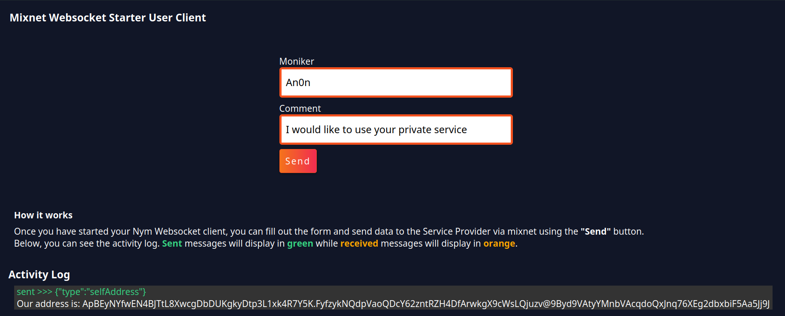
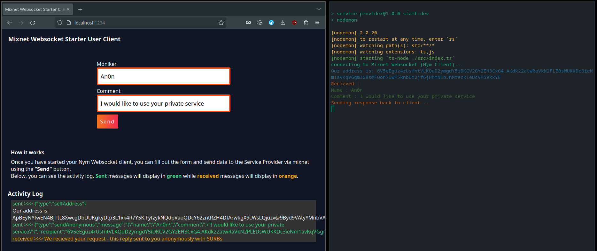

# Building a Simple Service Provider

In this guide, developers will learn how to build the foundation of a privacy-enabled application (PEApp) that can send and receive traffic from the mixnet.  

<!-- You can watch the step-by-step guide on creating your own Simple Service Provider [here](): -->

#### What are we building?

In this tutorial, you will learn how to build two essential components for sending messages through the mixnet:

- A __User Client__ written in TypeScript, which allows for accessing the mixnet through a browser on a local machine.
- A __Service Provider__ also written in TypeScript, which can receive messages from the mixnet.
- Additionally, you will be guided on how to configure a pair of __Nym Websocket Clients__ (__nym-client's__), which are necessary for connecting to the mixnet with your application.

> ⚠️ Service providers are usually run on remote servers to keep metadata private, but for demonstration purposes, this tutorial will show how to run it on a local machine, effectively sending messages back to ourselves via two different __nym-client's__. .


We'll dive into the process of creating a Typescript application from the ground up. We'll cover how to set up a __nym-client__ and connect it to the mixnet, as well as the necessary steps to send a properly formatted message through the mixnet to the Service Provider. Don't fret if your skills in Javascript or Typescript are a bit rusty, there will be plenty of code snippets to copy and paste along the way.

To assist in your learning, the complete code for this tutorial is available on [Github](https://github.com/nymtech/developer-tutorials). You can use it as a reference while building or simply download it and follow along as you progress through the tutorial."

#### What do we want to achieve?

We aim to create a user-friendly experience for sending data through the mixnet. The User Client will present a simple form accessible through a web browser, where users can enter their data. Once the form is completed, users can press a 'Send' button which will transmit the data straight to the Service Provider via the mixnet. The sent data will be visible within the user interface of the Service Provider, which can also be accessed through a web browser.

#### What is a Service Provider
'Service Providers' are the name given to any type of app that can communicate with the mixnet via a Nym Client. The [Network Requester](https://nymtech.net/docs/nodes/network-requester-setup.html) is an app that takes an outbound network request from the mixnet, performs that request (e.g. authenticating with a message server and receiving new messages) and then passes the response back to the user who requested it, shielding their metadata from the message server. 

The Service Provider covered in this tutorial is far more simple than this, as it just aims to show developers how to approach building something that can:
* connect to the mixnet, 
* listen for messages, and 
* perform some action with them (in this case, show them on a UI). 

### Prerequisites
* `node` & `npm` 
* `Typescript` 

#### Preparing your TypeScript environment  

Make a new directory called `simple-service-provider-tutorial` and inside it create another folder named `user-client`.

Continue to then do the following:

1.  In your terminal, navigate to `path/to/the/user-client` folder you created, and run:

    ```
    npm init
    ```
    Continue just press enter after each prompt to confirm the configuration.

    <details>
        <summary>Console Output</summary>
        
            This utility will walk you through creating a `package.json` file.
            It only covers the most common items, and tries to guess sensible defaults.

            See `npm help init` for definitive documentation on these fields
            and exactly what they do.

            Use `npm install <pkg>` afterwards to install a package and
            save it as a dependency in the package.json file.

            Press ^C at any time to quit.
            package name: (user-client)
            version: (1.0.0)
            description:
            entry point: (index.js)
            test command:
            git repository: 
            keywords:
            author: 
            license: (ISC) 
            About to write to path/to/directory/user-client/package.json:

            {
                "name": "user-client",
                "version": "1.0.0",
                "description": "",
                "main": "index.js",
                "scripts": {
                    "test": "echo \"Error: no test specified\" && exit 1"
                },
                "author": "",
                "license": "ISC"
            }

            Is this OK? (yes)
    </details>

    A `package.json` file has been created in the folder.

2.  Then in the same terminal, run:
    
    ```
    npm install typescript

    ```

    After the installation has been completed, check to see that the typescript dependencies have been added. The `package.json` file should look like this:
    ```json
    {
        "name": "user-client",
        "version": "1.0.0",
        "description": "",
        "main": "index.js",
        "scripts": {
            "test": "echo \"Error: no test specified\" && exit 1"
        },
        "author": "",
        "license": "ISC",
        "dependencies": {
            "typescript": "^4.9.3"
        }
    }
    ```    

3.  Now run in your terminal:
    
    ```
    npm install ts-node --save-dev
    ```

    The package (`ts-node`) allows us to build a typescript application in a node environment.

4.  Create a new file in the `user-client` folder called `tsconfig.json`. Paste the following code into the file:

    ```json
    {
        "compilerOptions": {
            "module": "commonjs",
            "esModuleInterop": true,
            "target": "es6",
            "moduleResolution": "node",
            "sourceMap": true,
            "outDir": "dist"
        },
        "lib": ["es2015"]
    }
    ```

#### Bundling the Application

To build and run our application locally, we require a tool that allows us to work on it while it's running and instantly reflects saved changes on the browser.

1.  This can be achieved through the installation of the [Parcel](https://parceljs.org/getting-started/webapp/) bundler 
    using the following command in your terminal window:

    ```
    npm install parcel-bundler
    ```

    After completing the installation process, start by creating a `src` folder within the `user-client` folder. Within this `src` folder, create two new files:
    * `index.html` 
    * `index.ts`


2.  Paste the following the `index.html`:
    
    ```
    <!DOCTYPE html>
    <html>
        <head>
            <title>App Test</title>
            <meta charset="utf-8"/>
        </head>
        <body>
            <h1>Test</h1>
            <div id="app"></div>
            <script src="index.ts"></script>
        </body>
    </html>

    ```

    And in the `index.ts`:

    ```
    console.log('test log')
    ```

    This will ensure that our TypeScript file is functional when the application is launched in the browser.
    
3.  Navigate to the `package.json` file and in the `"scripts"` array, add the following above `"test"`:

    ```
    "start": "parcel src/index.html"
    ```

    Now back in our terminal , run `npm start`.

    

    Open your browser at [localhost:1234](http://localhost:1234/). 

    Your web application is now up and running with `Test` displayed on the browser window.

    Checking the `console.log` output is done by right-clicking on the browser and selecting __Inspect__, then navigating to the __Console__ section of the resulting panel. You should see the message `test log` displayed there.

    
### Building the User Client

Building our __User Client__ focuses mainly on configuring and adding functions to `index.ts` file, in the `user-client` folder. It's where we establish the connection between our application and the mixnet, create the messages we want to send, and then send them to our service provider through the mixnet. 

Therefore we must implement the functions that connects our Typescript __User Client__ to our first __nym-client__.

1.  Replace the existing content of the `index.ts` file in the `user-client` folder with this function: 
    
    ```typescript
    async function main() {
    }

    function connectWebsocket(url) {
        return new Promise(function (resolve, reject) {
            var server = new WebSocket(url);
            console.log('connecting to Websocket Server (Nym Client)...')
            server.onopen = function () {
                resolve(server);
            };
            server.onerror = function (err) {
                reject(err);
            };
        
        });
    }
    
    main();
    ```
    * `main()` - This first function will hold the majority of the logic and initiate the connection with the __nym-client__. It's best to declare it at the start of the file and call it at the end to run when launching the application.

    * `connectWebsocket(url)` - In this function, we return a Promise that tries to set up a websocket connection to the url we provide as a parameter. If the connection is successful, we will get a notification in our application and __nym-client__. If it fails, we'll receive an error in our app. 

2.  Next, implement the functions that will handle DOM (Document Object Model) manipulation allowing the alteration of the UI depending on our interaction with the application.
    
    Before the `main()` declaration at the end of the file, add the following:
    
    ```typescript
        
        function handleResponse(resp) {
        try {
            let response = JSON.parse(resp.data);
            if (response.type == "error") {
                displayJsonResponse("Server responded with error: " + response.message);
            } else if (response.type == "selfAddress") {
                ourAddress = response.address;
                displayClientMessage("Our address is:  " + ourAddress + ", we will now send messages to ourself.");
            } else if (response.type == "received") {
                handleReceivedTextMessage(response)
            }
        } catch (_) {
                displayJsonResponse(resp.data)
            }
        }
        
        function handleReceivedTextMessage(message) {
            const text = JSON.parse(message.message);
            displayJsonResponse(text);
        }
        
        function displayJsonResponse(message) {
            let receivedDiv = document.createElement("div")
            let paragraph = document.createElement("p")
            paragraph.setAttribute('style', 'color: orange')
            let textNode = document.createTextNode(message.text + " From - " + message.fromAddress)
            paragraph.appendChild(textNode)
            
            receivedDiv.appendChild(paragraph)
            document.getElementById("output").appendChild(receivedDiv)
        }

        function displayClientMessage(message) {
            document.getElementById("output").innerHTML += "<p>" + message + "</p >";
        }

    ```

    This above functions are responsible for updating the UI when we either send or receive messages from our service provider.

    * `handleResponse()` - This function will take in the response it receives from the mixnet and will pass it to the appropriate function depending on th responses `type` value. The four common `type`'s that a mixnet message will fall into are `recieved`, `send`, `selfAddress` and `error`.

    * `handleReceivedTextMessage()` - We use this small function to ensure that our data is JSON format before we display the response on the UI. This is necessary since we receive our from the mixnet in a `stringified` format.

    * `displayJsonResponse()` - This function is responsible for printing messages onto our UI. It simply creates new `<p>` HTML elements for each message that needs to be displayed on screen.

    * `displayClientMessage()` - We use this function to display our own address upon starting the __User Client__ .

3.  Above our `main()` function, add the following code:

    ```typescript
    var ourAddress : string;

    var targetAddress: string;

    var websocketConnection: any;
    ```

    These variables are the main global variables of our application.

    * `ourAddress` - Automatically filled in upon receipt of a reply from the __nym-client's__ initialization.

    * `targetAddress` - A manually set parameter that points to the Service Provider's __nym-client__.

    * `websocketConnection` - Populated upon a successful response from our Promise within the `connectWebsocket()` function.

4.  Back inside the `main()` function, add the following:
  
    ```typescript
        async function main() {
            var port = '1977' // client websocket listens on 1977 by default.
            var localClientUrl = "ws://127.0.0.1:" + port;
            
            websocketConnection = await connectWebsocket(localClientUrl).then(function (c) {
                return c;
            }).catch(function (err) {
                displayClientMessage("Websocket connection error. Is the client running with <pre>--connection-type WebSocket</pre> on port " + port + "?");
            })

            websocketConnection.onmessage = function (e) {
                handleResponse(e);
            };
            
            sendSelfAddressRequest();
            
            const sendButton = document.querySelector('#send-button');
            
            sendButton?.addEventListener('click', function handleClick(event) {
                sendMessageToMixnet(); 
            });
        }

    ```

5. Currently the `sendSelfAddressRequest()` has not been defined. Add the following under between the `main()` and `displayClientMessage()` functions:

    ```typescript
        function sendSelfAddressRequest() {
            var selfAddress = {
                type: "selfAddress"
            }
            displayJsonSend(selfAddress);
            websocketConnection.send(JSON.stringify(selfAddress));
        }

    ```

    * `sendSelfAddressRequest()` - Function that retrieves the websocket address and displays it on the browser's UI after connecting to the websocket.

    Recap: So far, our added logic into our `main()` function will do the following:

    * State the port (set to `1977`, which our __nym-client__ listens to by default) and local client url (which we point to `localhost` (`127.0.0.1`)).
    * Called our `connectWebsocket()` function and assign the value it returns to `websocketConnection`.
    * Implemented the handling of any responses retrieved from the websocket, dependent of the value in the type attribute within the `handleResponse()` function.
    * Added the `sendSelfAddressRequest()` function which sends a object with an attribute type of `selfAddress` that retrieves the address of the __nym-client__.
    * Initially built `Send` button function which will purposely grab the sent data.

6. Underneath the `sendSelfAddressRequest()` function, add the following:

    ```typescript
        function sendMessageToMixnet() {

            var nameInput = (<HTMLInputElement>document.getElementById("nameInput")).value;
            var serviceSelect = (<HTMLInputElement>document.getElementById("serviceSelect")).value;
            var textInput = (<HTMLInputElement>document.getElementById("textInput")).value;
            
            const messageContentToSend = {
                name : nameInput,
                service : serviceSelect,
                comment : textInput,
                fromAddress : ourAddress
            }
            
            const message = {
                type: "send",
                message: JSON.stringify(messageContentToSend),
                recipient: targetAddress,
                withReplySurb: false,
            }
            
            displayJsonSend(message);
            
            websocketConnection.send(JSON.stringify(message));
        }

    ```

    * `sendMessageToMixnet()` - The key function that will allow our __Service Provider__ messages to receive messages. Firstly, it will gets the values from a form in the `index.html` and assign them to local variables within the function, inserting the local variables into one object to be sent to the mixnet. Secondly, calling the `displayJsonSend()` function to render the sent message on to the UI. Lastly, the `websocketConnection` global variable will send our message to the websocket. 

    The JSON.stringify our the data when passing to the `send()` function, because the __nym-client__ only accepts messages in string format and will throw an error if it receives a non-string value.

7. Below our `sendMessageToMixnet()` function, add the following:

    ```typescript
        function displayJsonSend(message) {
            let sendDiv = document.createElement("div")
            let paragraph = document.createElement("p")
            paragraph.setAttribute('style', 'color: #36d481')
            let paragraphContent = document.createTextNode("sent >>> " + JSON.stringify(message))
            paragraph.appendChild(paragraphContent)
            
            sendDiv.appendChild(paragraph)
            document.getElementById("output").appendChild(sendDiv)
        }
    ```

    * `displayJsonSend(message)` - Will show the message in the "Activity Log" section of the UI.

8. Replace the current `index.html` with the following, to reflect our output on the UI:

    ```html
    <!doctype html>
    <html>
        <head>
            <meta charset="UTF-8">
            <title>Mixnet Websocket Starter Client</title>
            <link rel="stylesheet" href="../assets/styles.css"/>
        </head>
        <body>
            <div class="content" role="main">
                <div class="toolbar">
                    <h3>Mixnet Websocket Starter User Client</h3>
                </div>
                
                <div class="section-container">
                
                    <label for="nameInput" class="form-field-label">Name</label>
                    <input id="nameInput" type="text" value="Freddy" name="nameInput">

                    <label class="form-field-label">Service</label>
                    <select class="" id="serviceSelect" name="serviceSelect">
                        <option value="service_1">Service 1</option>
                        <option value="service_2">Service 2</option>
                        <option value="service_3">Service 3</option>
                    </select>

                    <label for="textInput" class="form-field-label">Comment</label>
                    <input id="textInput" type="text" value="Hello, Service Provider. I would like to use a service!" name="textInput">
            
                    <div id="send-button">
                        <label for="send-button" class="submit-button">Send</label>
                    </div>
                </div>
            </div>
            
            <div class="" style="margin-left:20px;max-width: fit-content;">
                <div style="color: white;margin-bottom: 2rem;">
                        <h4>How it works</h4>
                        <p>Once you have started your nym-client(s), you can fill out the form and send data to the mixnet using the <b>"Send"</b> button.</p>
                        <p>Your message will then be relayed through your nym-client running on the port (specified using --port in the command line) which is set to 1977 by default.</p>
                        <p>Below, you can see the activity log. <b style='color: #36d481;'>Sent</b> messages will display in <b style='color: #36d481;'>green</b> while <b style='color: orange;'>received</b> messages will display in <b style='color: orange;'>orange</b>.</p>
                </div>
            </div>
            
            <h3 style="margin-left:10px">Activity Log</h3>
            
            <p class="output-container">
                <span id="output"></div>
            </p>
            <script src="index.ts"></script>
        </body>
    </html>

    ```

    Lets add the finishing touches to the UI by adding in the stylesheet which we specified at the top our our `index.html` above. Back in our project root folder (same folder level as `/src`), create an `/assets` folder and create a new file within it called `styles.css`. 

    We have made a stylesheet for this tutorial which can be accessed [here](Link to be added when merged). Copy and paste the contents into your newly created `styles.css` file, or simply paste in your own stylesheet! Once we've checked our browser to confirm our styles are working, lets move onto getting our application running.

9. Return back to your terminal and run:

    ```
    npm start
    ```

    Return to your open browser ([localhost:1234](http://localhost:1234/)) and you should see a new UI has been created for your User Client application.

    

### Connecting the nym-client

This far into the tutorial, we should have functioning __User Client__ to make the initial websocket connection that we're looking for. To connect our __nym-client__, go to [releases page](https://github.com/nymtech/nym/releases) to download the latest binaries release of the `nym-client`. Alternatively, download [here](https://nymtech.net/docs/stable/run-nym-nodes/build-nym/) and follow instructions to build the binaries from the monorepo. Once the `nym-client` latest binaries has been downloaded, we can begin connecting and executing of our websocket functionality.  

1.  Open a new terminal window, and `path/to/the/release` folder, and run the following to initialize your first `nym-client`:

    ```
    ./nym-client init --id user-client
    ```
    <details>
        <summary>Console Output</summary>
        
            _ __  _   _ _ __ ___
            | '_ \| | | | '_ \ _ \
            | | | | |_| | | | | | |
            |_| |_|\__, |_| |_| |_|
                    |___/

                    (client - version {{platform_release_version}})

            
        Initialising client...
        Client "user-client" was already initialised before! Config information will be overwritten (but keys will be kept)!
        Not registering gateway, will reuse existing config and keys
        2023-01-30T09:22:11.446Z INFO  config > Configuration file will be saved to "/Users/oliveranyanwu_nym_tech/.nym/clients/user-client/config/config.toml"
        Saved configuration file to "/Users/oliveranyanwu_nym_tech/.nym/clients/user-client/config/config.toml"
        Using gateway: 5Ao1J38frnU9Rx5YVeF5BWExcnDTcW8etNe9W2sRASXD
        Client configuration completed.

        Version: 1.1.4
        ID: user-client 
        Identity key: 5hjx1NGdGfd4rGDPfB2r8E85dEVZ6vgy135fP3nMuWWM
        Encryption: LwnvsnVzwUCMxxLM8e6HZ395pSPc9NDdmCXtHHVMfCG
        Gateway ID: 5Ao1J38frnU9Rx5YVeF5BWExcnDTcW8etNe9W2sRASXD
        Gateway: ws://178.18.240.56:9001
        Client listening port: 1977

        The address of this client is: 5hjx1NGdGfd4rGDPfB2r8E85dEVZ6vgy135fP3nMuWWM.LwnvsnVzwUCMxxLM8e6HZ395pSPc9NDdmCXtHHVMfCG@5Ao1J38frnU9Rx5YVeF5BWExcnDTcW8etNe9W2sRASXD
    </details>

    > ⚠️ The client address generated by executing a command in a terminal will always be unique and distinct from the address generated by any other client executing the same command.

2.  Run the `nym-client` using:

    ```
    ./nym-client run --id user-client 
    ```

    <details>
        <summary>Console Output</summary>


                    (client - version {{platform_release_version}})

        2023-01-30T09:28:52.773Z INFO  client_core::client::base_client::non_wasm_helpers > loading existing surb database
        2023-01-30T09:28:52.775Z INFO  client_core::client::replies::reply_storage::backend::fs_backend::manager > Database migration finished!
        2023-01-30T09:28:52.776Z ERROR client_core::client::replies::reply_storage::backend::fs_backend          > the client hasn't undergone through graceful shutdown the last time it's gone down - we can't trust its reply surbs or stored encryption keys. They shall get purged
        2023-01-30T09:28:52.777Z INFO  client_core::client::replies::reply_storage::backend::fs_backend          > it's been over 6 days and 163 hours since we last used our data store. our reply surbs are already outdated - we're going to purge them now.
        2023-01-30T09:28:52.778Z INFO  client_core::client::replies::reply_storage::backend::fs_backend          > it's been over 6 days and 163 hours since we last used our data store. our reply keys are already outdated - we're going to purge them now.
        2023-01-30T09:28:52.778Z INFO  client_core::client::replies::reply_storage::backend::fs_backend          > it's been over 6 days and 163 hours since we last used our data store. our used sender tags are already outdated - we're going to purge them now.
        2023-01-30T09:28:52.779Z INFO  client_core::client::base_client                                          > Starting nym client
        2023-01-30T09:28:52.956Z INFO  gateway_client::client                                                    > the gateway is using exactly the same protocol version as we are. We're good to continue!
        2023-01-30T09:28:52.960Z INFO  client_core::client::base_client                                          > Obtaining initial network topology
        2023-01-30T09:28:54.077Z INFO  client_core::client::base_client                                          > Starting topology refresher...
        2023-01-30T09:28:54.077Z INFO  client_core::client::base_client                                          > Starting received messages buffer controller...
        2023-01-30T09:28:54.077Z INFO  client_core::client::base_client                                          > Starting mix traffic controller...
        2023-01-30T09:28:54.077Z INFO  client_core::client::base_client                                          > Starting real traffic stream...
        2023-01-30T09:28:54.077Z INFO  client_core::client::base_client                                          > Starting loop cover traffic stream...
        2023-01-30T09:28:54.077Z INFO  nym_client::client                                                        > Starting websocket listener...
        2023-01-30T09:28:54.077Z INFO  nym_client::websocket::listener                                           > Running websocket on "127.0.0.1:1977"
        2023-01-30T09:28:54.077Z INFO  nym_client::client                                                        > Client startup finished!
        2023-01-30T09:28:54.077Z INFO  nym_client::client                                                        > The address of this client is: 5hjx1NGdGfd4rGDPfB2r8E85dEVZ6vgy135fP3nMuWWM.LwnvsnVzwUCMxxLM8e6HZ395pSPc9NDdmCXtHHVMfCG@5Ao1J38frnU9Rx5YVeF5BWExcnDTcW8etNe9W2sRASXD
    </details>

    The __nym-client__ for our Typescript Script is now up and running, and we can refresh the browser application to see the changes. In the 'Activity Log' of the UI, there's a successful response from our websocket, thus we're able to see the same address from our terminal. If we were to terminate our `nym-client`, we can an error on the browser UI stating a missing websocket connection. This is a good sign of error handling.

    We can now rerun the same `nym-client`.

### Adding our Service Provider

To completing the full cycle of the websocket functionality, we must create the __Service Provider__. 

Begin by creating a `service-provider` folder in the `simple-service-provider-tutorial` root directory.

From the [Preparing your Typescript environment](#preparing-your-typescript-environment) section of tutorial guide, repeat the step `1`.

> ⚠️ Remember to reference this section of the tutorial to the `service-provider`, instead of `user-client`. 

1.  Inside your newly generated `package.json`, paste in the following code:

    ```json
    {
        "name": "service-provider",
        "version": "1.0.0",
        "description": "",
        "main": "index.js",
        "scripts": {
            "start:dev": "nodemon",
            "test": "echo \"Error: no test specified\" && exit 1"
        },
        "devDependencies": {
            "@types/node": "^18.14.0",
            "@types/ws": "^8.5.4",
            "nodemon": "^2.0.20",
            "ts-node": "^10.9.1",
            "typescript": "^4.8.4"
        },
        "author": "",
        "license": "ISC",
        "dependencies": {
            "ws": "^8.12.0"
        }
    }

    ```
    For our __Service Provider__ , we will be running it as a `nodemon` application that will run in the terminal.

    Lets install the packages we have specified in above `package.json` by running:

    ```
    npm install

    ``` 

2.  Create a `tsconfig.json` file in the same directory and paste in the following code:

    ```json
    {
        "compilerOptions": {
        "target": "es2017", 
        "lib": [
            "es6"
        ],
        "module": "Node16", 
        "rootDir": "src", 
        "resolveJsonModule": true, 
        "allowJs": true,                      
        "outDir": "build", 
        "esModuleInterop": true, 
        "forceConsistentCasingInFileNames": true, 
        "strict": true, 
        "noImplicitAny": true, 
        "skipLibCheck": true 
        }
    }
    ```
3.  Create a `nodemon.json` file in the same directory which will act as our `nodemon` configuration. Paste in the following code inside that file:
    ```json
    {
        "watch": [
            "src"
        ],
        "ext": ".ts,.js",
        "ignore": [],
        "exec": "ts-node ./src/index.ts"
    }
    ```

    Now that we have the necessary components to ensure the application will run, lets implement the applications logic in the next section.

#### Service Provider Typescript Code

Create a folder names `/src` the same level as our previous three files we created. Inside it, create an `index.ts` file and paste in the following code:

```typescript
    import WebSocket, { MessageEvent } from "ws";

    var ourAddress : string;
    var websocketConnection : any;

    async function main() {
        var port = '1978' // client websocket listens on 1977 by default, change if yours is different
        var localClientUrl = "ws://127.0.0.1:" + port;

        websocketConnection = await connectWebsocket(localClientUrl).then(function (c) {
            return c;
        }).catch(function (err) {
            console.log("Websocket connection error. Is the client running with <pre>--connection-type WebSocket</pre> on port " + port + "?");
            console.log(err);
        })

        websocketConnection.onmessage = function (e : any) {
            handleResponse(e);
        };

        sendSelfAddressRequest();
    }

    function handleResponse(responseMessageEvent : MessageEvent) {

        try {
                let response = JSON.parse(responseMessageEvent.data.toString());
            if (response.type == "error") {
                console.log("\x1b[91mAn error occured: " + response.message + "\x1b[0m")
            } else if (response.type == "selfAddress") {
                ourAddress = response.address;
                console.log("\x1b[94mOur address is: " + ourAddress + "\x1b[0m")
            } else if (response.type == "received") {
                let messageContent = JSON.parse(response.message)

                console.log('\x1b[93mRecieved : \x1b[0m');
                console.log('\x1b[92mName : ' + messageContent.name + '\x1b[0m');
                console.log('\x1b[92mService : ' + messageContent.service + '\x1b[0m');
                console.log('\x1b[92mComment : ' + messageContent.comment + '\x1b[0m');

                console.log('\x1b[93mSending response back to client... \x1b[0m')
                sendMessageToMixnet(messageContent.fromAddress)

            }
        } catch (_) {
            console.log('something went wrong in handleResponse')
        }
    }

    function sendMessageToMixnet(targetAddress : any) {

        const messageContentToSend = {
            text : 'We recieved your request!',
            fromAddress : ourAddress
        }
        
        const message = {
            type: "send",
            message: JSON.stringify(messageContentToSend),
            recipient: targetAddress,
            withReplySurb: false,
        }
        
        websocketConnection.send(JSON.stringify(message));
    }

    function sendSelfAddressRequest() {
        var selfAddress = {
            type: "selfAddress"
        }
        websocketConnection.send(JSON.stringify(selfAddress));
    }

    function connectWebsocket(url : string) {
        return new Promise(function (resolve, reject) {
            var server = new WebSocket(url);
            console.log('connecting to Mixnet Websocket (Nym Client)...')
            server.onopen = function () {
                resolve(server);
            };
            server.onerror = function (err) {
                reject(err);
            };

        });
    }

    main();

```

> You may observe that we possess similar functions to the __User Client__ code, with only a few differences in the objectives of a few functions, mainly our `handleResponse()` function.

* `main()` - Just like our __User Client__, our `main()` function will still be the function in charge of our initializing and executing our application. We connect to our websocket in the exact same way as we do in our __User Client__ code except we want to set our `port` local variable to '1978'. This is so we don't have a conflict with the other __nym-client__ (the one that we are running for our __User Client__ on `port` 1977). So when we launch our second __nym-client__, we will set the `--port` to 1978 when we get to initializing it (coming up further in the tutorial).

* `handleResponse()` - When it comes to the sorting between types of incoming messages, its works relatively the same as the function with the same name defined in our __User Client__. The main difference is within how we are logging our data (which will be displayed in our terminal once the application is up and running).

The '\x1b' orefix you see in our console.log enables the ability for us to color our 'console.log' statements. The number that you see following the '[' and preceeding 'm' is the color code that can be compared here - https://en.m.wikipedia.org/wiki/ANSI_escape_code#Colors. Its a nice and quick way of styling our terminal output.

* `sendMessageToMixnet()` - When we receive a message from the __User Client__, we want to send a response back to notify the the user that the __Service Provider__ recieved their request successfully. We dont need to define use any DOM elements to populate our message since its a console application. We can simply send a single message back and send it to the address that we receive in the payload from the __User Client__.  

We'll be connecting to the __nym-client__ in the same way as the __User Client__, so we can reuse the following functions for the __Service Provider__: 
* `sendSelfAddressRequest()`
* `connectWebsocket(url)`

Before we get our __Service Provider__ up and running, lets get our second __nym-client__ up and running

#### Getting the Service Provider connected.

Lets get get our __Service Provider's__ __nym-client__ running.

1.  To get the __Service Provider's__ __nym-client__ running, navigate to `path/to/the/release` folder (like we did with our __User Client__ 
    instance) and run the following to initialize 
    your second `nym-client`: 
         
    ```
    ./nym-client init --id service-provider --port 1978
    ```

    We want to specify port `1978` since thats the port specified in our `index.ts`. Different `nym-client`'s must run on different ports in order to avoid conflicts.

2.  Then run:

    ```
    ./nym-client run --id service-provider
    ```

    The second __nym-client__ is now running!

    

    We can see that we get our __nym-client__ Address successfully.

3.  The final step of this tutorial is to update the `targetAddress` in the __User Client__'s `index.ts`. Assign the global variable
    `targetAddress` we initialized, with the address of the __Service Provider's__ __nym-client__. Feel free to copy and paste the resulting address that you see in your terminal (purple text).

    ```
    var targetAddress = '<service-provider-websocket-client-address>';
    ```

We should have the following set up:

* A Single __User Client__  Web App running in the terminal and its UI in the Web Browser
* A Single __Service Provider__ Nodemon App running in the terminal 
* Two Websocket Clients (__nym-client's__) for each App in the terminal

We can now attempt to send a message by completing the fields on the __User Client__ browser app and pressing __'Send'__.

After clicking __'Send'__, you can observe a message sent from the __User Client__ to the __Service Provider__ via the mixnet in the browser app, thus creating a basic web application in the process.

We encourage developers to use this small project as a template to start conceptualizing and developing their own privacy based applications. The application is in a state where it can be easily restructured, refactored and integrated into existing solutions for limitless categories of Web Applications.




    

    


    


   
