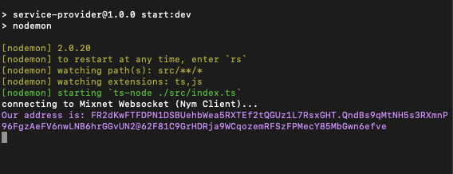

# Building a Simple Service Provider

This tutorial is the best place to start for developers new to Nym. You will learn how to build a minimum viable privacy-enabled application (PEApp) able to send and receive traffic via the mixnet.

   
### Adding our Service Provider

To completing the full cycle of the websocket functionality, we must create the __Service Provider__. 

Begin by creating a `service-provider` folder in the `simple-service-provider-tutorial` root directory.

From the [Preparing your Typescript environment](#preparing-your-typescript-environment) section of tutorial guide, repeat the step `1`.

> ⚠️ Remember to reference this section of the tutorial to the `service-provider`, instead of `user-client`. 

1.  Inside your newly generated `package.json`, paste in the following code:

    ```json
    {
        "name": "service-provider",
        "version": "1.0.0",
        "description": "",
        "main": "index.js",
        "scripts": {
            "start:dev": "nodemon",
            "test": "echo \"Error: no test specified\" && exit 1"
        },
        "devDependencies": {
            "@types/node": "^18.14.0",
            "@types/ws": "^8.5.4",
            "nodemon": "^2.0.20",
            "ts-node": "^10.9.1",
            "typescript": "^4.8.4"
        },
        "author": "",
        "license": "ISC",
        "dependencies": {
            "ws": "^8.12.0"
        }
    }

    ```
    For our __Service Provider__ , we will be running it as a `nodemon` application that will run in the terminal.

    Lets install the packages we have specified in above `package.json` by running:

    ```
    npm install

    ``` 

2.  Create a `tsconfig.json` file in the same directory and paste in the following code:

    ```json
    {
        "compilerOptions": {
        "target": "es2017", 
        "lib": [
            "es6"
        ],
        "module": "Node16", 
        "rootDir": "src", 
        "resolveJsonModule": true, 
        "allowJs": true,                      
        "outDir": "build", 
        "esModuleInterop": true, 
        "forceConsistentCasingInFileNames": true, 
        "strict": true, 
        "noImplicitAny": true, 
        "skipLibCheck": true 
        }
    }
    ```
3.  Create a `nodemon.json` file in the same directory which will act as our `nodemon` configuration. Paste in the following code inside that file:
    ```json
    {
        "watch": [
            "src"
        ],
        "ext": ".ts,.js",
        "ignore": [],
        "exec": "ts-node ./src/index.ts"
    }
    ```

    Now that we have the necessary components to ensure the application will run, lets implement the applications logic in the next section.

#### Service Provider Typescript Code

Create a folder names `/src` the same level as our previous three files we created. Inside it, create an `index.ts` file and paste in the following code:

```typescript
    import WebSocket, { MessageEvent } from "ws";

    var ourAddress : string;
    var websocketConnection : any;

    async function main() {
        var port = '1978' // client websocket listens on 1977 by default, change if yours is different
        var localClientUrl = "ws://127.0.0.1:" + port;

        websocketConnection = await connectWebsocket(localClientUrl).then(function (c) {
            return c;
        }).catch(function (err) {
            console.log("Websocket connection error. Is the client running with <pre>--connection-type WebSocket</pre> on port " + port + "?");
            console.log(err);
        })

        websocketConnection.onmessage = function (e : any) {
            handleResponse(e);
        };

        sendSelfAddressRequest();
    }

    function handleResponse(responseMessageEvent : MessageEvent) {

        try {
                let response = JSON.parse(responseMessageEvent.data.toString());
            if (response.type == "error") {
                console.log("\x1b[91mAn error occured: " + response.message + "\x1b[0m")
            } else if (response.type == "selfAddress") {
                ourAddress = response.address;
                console.log("\x1b[94mOur address is: " + ourAddress + "\x1b[0m")
            } else if (response.type == "received") {
                let messageContent = JSON.parse(response.message)

                console.log('\x1b[93mRecieved : \x1b[0m');
                console.log('\x1b[92mName : ' + messageContent.name + '\x1b[0m');
                console.log('\x1b[92mService : ' + messageContent.service + '\x1b[0m');
                console.log('\x1b[92mComment : ' + messageContent.comment + '\x1b[0m');

                console.log('\x1b[93mSending response back to client... \x1b[0m')
                sendMessageToMixnet(messageContent.fromAddress)

            }
        } catch (_) {
            console.log('something went wrong in handleResponse')
        }
    }

    function sendMessageToMixnet(targetAddress : any) {

        const messageContentToSend = {
            text : 'We recieved your request!',
            fromAddress : ourAddress
        }
        
        const message = {
            type: "send",
            message: JSON.stringify(messageContentToSend),
            recipient: targetAddress,
            withReplySurb: false,
        }
        
        websocketConnection.send(JSON.stringify(message));
    }

    function sendSelfAddressRequest() {
        var selfAddress = {
            type: "selfAddress"
        }
        websocketConnection.send(JSON.stringify(selfAddress));
    }

    function connectWebsocket(url : string) {
        return new Promise(function (resolve, reject) {
            var server = new WebSocket(url);
            console.log('connecting to Mixnet Websocket (Nym Client)...')
            server.onopen = function () {
                resolve(server);
            };
            server.onerror = function (err) {
                reject(err);
            };

        });
    }

    main();

```

> You may observe that we possess similar functions to the __User Client__ code, with only a few differences in the objectives of a few functions, mainly our `handleResponse()` function.

* `main()` - Just like our __User Client__, our `main()` function will still be the function in charge of our initializing and executing our application. We connect to our websocket in the exact same way as we do in our __User Client__ code except we want to set our `port` local variable to '1978'. This is so we don't have a conflict with the other __nym-client__ (the one that we are running for our __User Client__ on `port` 1977). So when we launch our second __nym-client__, we will set the `--port` to 1978 when we get to initializing it (coming up further in the tutorial).

* `handleResponse()` - When it comes to the sorting between types of incoming messages, its works relatively the same as the function with the same name defined in our __User Client__. The main difference is within how we are logging our data (which will be displayed in our terminal once the application is up and running).

The '\x1b' orefix you see in our console.log enables the ability for us to color our 'console.log' statements. The number that you see following the '[' and preceeding 'm' is the color code that can be compared here - https://en.m.wikipedia.org/wiki/ANSI_escape_code#Colors. Its a nice and quick way of styling our terminal output.

* `sendMessageToMixnet()` - When we receive a message from the __User Client__, we want to send a response back to notify the the user that the __Service Provider__ recieved their request successfully. We dont need to define use any DOM elements to populate our message since its a console application. We can simply send a single message back and send it to the address that we receive in the payload from the __User Client__.  

We'll be connecting to the __nym-client__ in the same way as the __User Client__, so we can reuse the following functions for the __Service Provider__: 
* `sendSelfAddressRequest()`
* `connectWebsocket(url)`

Before we get our __Service Provider__ up and running, lets get our second __nym-client__ up and running

#### Getting the Service Provider connected.

Lets get get our __Service Provider's__ __nym-client__ running.

1.  To get the __Service Provider's__ __nym-client__ running, navigate to `path/to/the/release` folder (like we did with our __User Client__ 
    instance) and run the following to initialize 
    your second `nym-client`: 
         
    ```
    ./nym-client init --id service-provider --port 1978
    ```

    We want to specify port `1978` since thats the port specified in our `index.ts`. Different `nym-client`'s must run on different ports in order to avoid conflicts.

2.  Then run:

    ```
    ./nym-client run --id service-provider
    ```

    The second __nym-client__ is now running!

    

    We can see that we get our __nym-client__ Address successfully.

3.  The final step of this tutorial is to update the `targetAddress` in the __User Client__'s `index.ts`. Assign the global variable
    `targetAddress` we initialized, with the address of the __Service Provider's__ __nym-client__. Feel free to copy and paste the resulting address that you see in your terminal (purple text).

    ```
    var targetAddress = '<service-provider-websocket-client-address>';
    ```

We should have the following set up:

* A Single __User Client__  Web App running in the terminal and its UI in the Web Browser
* A Single __Service Provider__ Nodemon App running in the terminal 
* Two Websocket Clients (__nym-client's__) for each App in the terminal

We can now attempt to send a message by completing the fields on the __User Client__ browser app and pressing __'Send'__.

After clicking __'Send'__, you can observe a message sent from the __User Client__ to the __Service Provider__ via the mixnet in the browser app, thus creating a basic web application in the process.

We encourage developers to use this small project as a template to start conceptualizing and developing their own privacy based applications. The application is in a state where it can be easily restructured, refactored and integrated into existing solutions for limitless categories of Web Applications.


    

    


    


   
