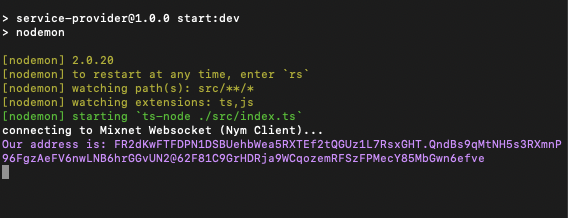

# Building Your Service Provider
   
* Paste the following code into `src/index.ts`

```typescript
import WebSocket, { MessageEvent } from "ws";

var ourAddress:          string;
var websocketConnection: any;

async function main() {
    var port = '1978'; 
    var localClientUrl = "ws://127.0.0.1:" + port;

    websocketConnection = await connectWebsocket(localClientUrl).then(function (c) {
        return c;
    }).catch(function (err) {
        console.log("Websocket connection error. Is the client running with <pre>--connection-type WebSocket</pre> on port " + port + "?");
        console.log(err);
    })

    websocketConnection.onmessage = function (e : any) {
        handleResponse(e);
    };

    sendSelfAddressRequest();
}

function handleResponse(responseMessageEvent : MessageEvent) {

    try {
            let response = JSON.parse(responseMessageEvent.data.toString());
        if (response.type == "error") {
            console.log("\x1b[91mAn error occured: " + response.message + "\x1b[0m")
        } else if (response.type == "selfAddress") {
            ourAddress = response.address;
            console.log("\x1b[94mOur address is: " + ourAddress + "\x1b[0m")
        } else if (response.type == "received") {
            let messageContent = JSON.parse(response.message)

            console.log('\x1b[93mRecieved : \x1b[0m');
            console.log('\x1b[92mName : ' + messageContent.name + '\x1b[0m');
            console.log('\x1b[92mService : ' + messageContent.service + '\x1b[0m');
            console.log('\x1b[92mComment : ' + messageContent.comment + '\x1b[0m');

            console.log('\x1b[93mSending response back to client... \x1b[0m')
            sendMessageToMixnet(messageContent.fromAddress)

        }
    } catch (_) {
        console.log('something went wrong in handleResponse')
    }
}

function sendMessageToMixnet(targetAddress : any) {

    const messageContentToSend = {
        text : 'We recieved your request!',
        fromAddress : ourAddress
    }
        
    const message = {
        type: "send",
        message: JSON.stringify(messageContentToSend),
        recipient: targetAddress,
        withReplySurb: false,
    }
        
    websocketConnection.send(JSON.stringify(message));
}

function sendSelfAddressRequest() {
    var selfAddress = {
        type: "selfAddress"
    }
    websocketConnection.send(JSON.stringify(selfAddress));
}

function connectWebsocket(url : string) {
    return new Promise(function (resolve, reject) {
        var server = new WebSocket(url);
        console.log('connecting to Mixnet Websocket (Nym Client)...')
        server.onopen = function () {
            resolve(server);
        };
        server.onerror = function (err) {
            reject(err);
        };

    });
}

main();
```

`main()` is still the function in charge of initializing and executing your application. Note that the SP's client is running on port `1978`. This is so we don't have a conflict with the client we have running for the UC part of our tutorial code! 

`handleResponse()` works in a similar manner as the function with the same name in `simple-service-provider/user-client/src/index.ts`. This implementation logs to the console instead of passing messages to a UI.  

The '\x1b' prefix you see in `console.log` adds colour to console ouput. The number that you see following the '[' and preceeding 'm' is the color code that can be compared [here](https://en.m.wikipedia.org/wiki/ANSI_escape_code#Colors). Its a nice and quick way of styling our terminal output.

When the SP receives a message from the mixnet, `sendMessageToMixnet()` sends a response back to notify the the user that the SP recieved their request successfully. 

## Connecting to your Nym Client

* Follow instructions in the [Nym websocket client documentation](https://nymtech.net/docs/clients/websocket-client.html#initialising-your-client)to `init` and `run` a client. 

```admonish caution title=""
Remember to `init` and `run` this client using port `1978` to avoid port clashes. 
```

* Refresh your browser window. You should see a successful response, including a Nym address, in the 'Activity Log' of the UI



## Set Service Address in User Client
The final step of this tutorial is to update the `targetAddress` in `simple-service-provider/user-client/src/index.ts`. 

Copy the Nym address from your console and set it as the value of the `targetAddress` variable on line 2. 

```
var targetAddress = 'address from your console;
```

